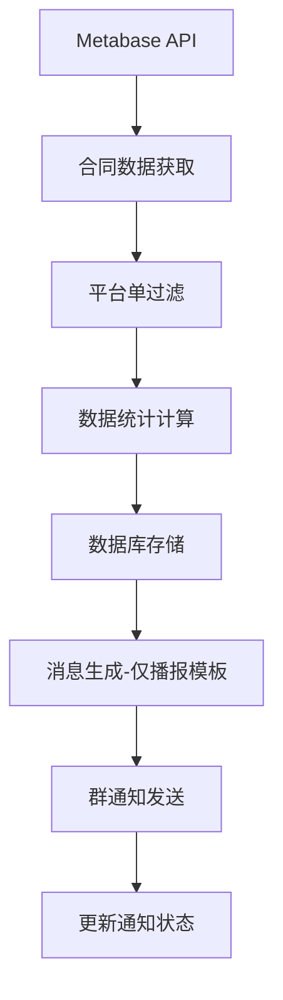

# 北京2025年11月销售激励活动技术设计文档

## 1. 项目概述

### 1.1 活动背景
北京2025年11月销售激励活动是一个极简化的活动，**不进行任何奖励发放，仅播报平台单合同签约信息**。这是在现有新架构基础上的一次特殊业务场景实现，体现了系统配置驱动和通用性设计的优势。

### 1.2 技术目标
- 基于新架构核心模块实现北京11月活动
- 通过配置驱动实现"仅播报"模式
- 设计通用的"仅播报"功能，便于未来复用
- 保持与现有系统的完全兼容性
- 不影响北京、上海10月份的活动逻辑

### 1.3 核心特性
- **仅播报模式**：不计算任何奖励，只发送签约喜报
- **平台单专注**：仅处理和播报平台单合同
- **极简配置**：禁用所有奖励相关配置
- **通用设计**：为未来类似活动提供可复用的模式

## 2. 需求分析

### 2.1 业务需求对比

| 需求项目 | 北京10月 | 上海10月 | 北京11月 |
|----------|---------|---------|----------|
| **幸运数字** | 平台单个人序号5倍数 | 无 | **无** |
| **节节高奖励** | 平台单+自引单总计 | 仅平台单 | **无** |
| **自引单奖励** | 无 | 无 | **无** |
| **合同门槛** | 10个合同 | 5个合同 | **无门槛** |
| **双轨统计** | 支持 | 不支持 | **不需要** |
| **播报范围** | 平台单+自引单 | 仅平台单 | **仅平台单** |
| **消息类型** | 群通知+奖励通知 | 群通知+奖励通知 | **仅群通知** |
| **业务模式** | 奖励激励 | 奖励激励 | **仅播报** |

### 2.2 关键业务逻辑

#### 2.2.1 数据处理逻辑
```
1. 获取合同数据（从Metabase API）
2. 过滤：仅处理平台单（sourceType = 2）
3. 统计：记录全局序号和个人序号
4. 存储：保存到数据库
5. 通知：发送签约喜报（无奖励信息）
```

#### 2.2.2 消息播报逻辑
```
条件：平台单合同完成线上收款
内容：签约喜报（包含合同信息、累计统计）
方式：企业微信群通知
频率：每个合同一次
```

#### 2.2.3 消息格式设计
```
🧨🧨🧨 签约喜报 🧨🧨🧨

恭喜 【管家姓名】 签约合同 【合同编号】 并完成线上收款🎉🎉🎉

🌻 本单为平台本月累计签约第 【全局序号】 单

🌻 个人累计签约第 【个人序号】 单，累计签约 【累计金额】 元

👊 继续加油，再接再厉！🎉🎉🎉
```

**消息格式说明**：
- 不显示工单类型（因为只播报平台单）
- 不显示双轨统计（不需要区分）
- 不显示奖励进度信息（无奖励）
- 使用固定的鼓励语

## 3. 技术架构设计

### 3.1 新架构适配方案

#### 3.1.1 核心设计原则
- **配置驱动**：通过 `BJ-2025-11` 配置实现"仅播报"模式
- **通用设计**：将"仅播报"设计为可复用的通用功能
- **最小修改**：仅在必要的扩展点添加新逻辑
- **向后兼容**：不影响现有北京10月和上海10月的功能

#### 3.1.2 架构组件映射

| 新架构组件 | 北京11月适配 | 修改类型 |
|------------|-------------|----------|
| **ProcessingConfig** | 禁用所有奖励 | 配置修改 |
| **RewardCalculator** | 支持空奖励配置 | 通用代码升级 |
| **NotificationService** | 添加简化消息模板 | 代码扩展 |
| **DataProcessingPipeline** | 添加平台单过滤 | 通用代码升级（可选） |
| **PerformanceDataStore** | 复用现有逻辑 | 无修改 |
| **RecordBuilder** | 复用现有逻辑 | 无修改 |

### 3.2 数据流设计



**关键流程说明**：
- 跳过奖励计算环节
- 跳过个人奖励通知环节
- 简化消息生成逻辑

## 4. 详细设计

### 4.1 配置文件设计

#### 4.1.1 BJ-2025-11 配置
```python
"BJ-2025-11": {
    # 禁用幸运数字
    "lucky_number": "",
    "lucky_number_mode": "personal_sequence",
    "lucky_number_sequence_type": "personal",
    
    # 禁用幸运数字奖励
    "lucky_rewards": {
        "base": {"name": "", "threshold": 0},
        "high": {"name": "", "threshold": 999999999}
    },
    
    # 性能限制配置（可选，因为无奖励计算）
    "performance_limits": {
        "single_project_limit": 50000,
        "enable_cap": False,  # 不启用上限
        "single_contract_cap": 50000
    },
    
    # 禁用节节高奖励
    "tiered_rewards": {
        "min_contracts": 0,  # 无门槛
        "tiers": []  # 空奖励列表
    },
    
    # 空奖励映射
    "awards_mapping": {},
    
    # 禁用自引单奖励
    "self_referral_rewards": {
        "enable": False
    },
    
    # 奖励计算策略：仅播报模式
    "reward_calculation_strategy": {
        "type": "announcement_only",  # 新增策略类型
        "rules": {
            "default": {
                "enable_tiered_rewards": False,
                "stats_source": "platform_only"
            }
        }
    },
    
    # 通知配置：仅播报模式
    "notification_config": {
        "template_type": "announcement_only",  # 消息模板类型
        "enable_award_notification": False,  # 禁用个人奖励通知
        "show_order_type": False,  # 不显示工单类型
        "show_dual_track_stats": False,  # 不显示双轨统计
        "show_reward_progress": False,  # 不显示奖励进度
        "closing_message": "继续加油，再接再厉！"  # 固定结束语
    },
    
    # 数据处理配置
    "processing_config": {
        "process_platform_only": True,  # 仅处理平台单
        "enable_historical_contracts": False  # 不处理历史合同
    },
    
    # 徽章配置
    "badge_config": {
        "enable_elite_badge": False,
        "enable_rising_star_badge": False
    }
}
```

### 4.2 代码修改方案

#### 4.2.1 RewardCalculator 通用升级（必需）
**文件**: `modules/core/reward_calculator.py`

**修改点**: 添加对空奖励配置的支持

```python
def calculate_tiered_rewards(self, housekeeper_stats: HousekeeperStats, 
                            order_type: OrderType = None) -> List[RewardInfo]:
    """计算节节高奖励 - 支持空配置"""
    
    # 获取奖励配置
    tiered_config = self.config.get("tiered_rewards", {})
    tiers = tiered_config.get("tiers", [])
    
    # 🔧 新增：如果 tiers 为空，直接返回空列表（仅播报模式）
    if not tiers:
        logging.debug("节节高奖励已禁用（tiers为空）")
        return []
    
    # 原有逻辑继续...
    min_contracts = tiered_config.get("min_contracts", 5)
    # ...
```

**修改点**: 支持 announcement_only 策略

```python
def calculate_rewards(self, contract_data: ContractData, 
                     housekeeper_stats: HousekeeperStats,
                     global_sequence: int = None,
                     personal_sequence: int = None,
                     housekeeper_award_lists: Dict = None) -> List[RewardInfo]:
    """计算所有奖励 - 支持仅播报模式"""
    
    # 🔧 新增：检查是否为仅播报模式
    strategy = self.config.get("reward_calculation_strategy", {})
    if strategy.get("type") == "announcement_only":
        logging.debug("仅播报模式，跳过所有奖励计算")
        return []
    
    # 原有奖励计算逻辑...
    rewards = []
    # ...
    return rewards
```

#### 4.2.2 NotificationService 扩展（必需）
**文件**: `modules/core/notification_service.py`

**修改点**: 添加北京11月专用消息模板

```python
def _send_group_notification(self, record: Dict):
    """发送群通知 - 支持多种消息模板"""
    
    service_housekeeper = record['管家(serviceHousekeeper)']
    
    # 处理徽章逻辑（北京地区）
    if self.config.city.value == "BJ":
        service_housekeeper = self._apply_badge_logic(service_housekeeper)
    
    # 🔧 新增：北京11月专用消息模板（仅播报模式）
    if self.config.config_key == "BJ-2025-11":
        contract_num = record.get("合同编号(contractdocNum)", "")
        global_sequence = record.get("活动期内第几个合同", 0)
        personal_count = record.get("管家累计单数", 0)
        accumulated_amount = self._format_amount(record.get('管家累计金额', 0))
        
        msg = f'''🧨🧨🧨 签约喜报 🧨🧨🧨

恭喜 {service_housekeeper} 签约合同 {contract_num} 并完成线上收款🎉🎉🎉

🌻 本单为平台本月累计签约第 {global_sequence} 单

🌻 个人累计签约第 {personal_count} 单，累计签约 {accumulated_amount} 元

👊 继续加油，再接再厉！🎉🎉🎉
'''
    
    # 北京10月专用消息模板
    elif self.config.config_key == "BJ-2025-10":
        # ... 现有逻辑 ...
    
    # 其他配置使用原有逻辑
    else:
        # ... 现有逻辑 ...
    
    # 创建群通知任务
    group_name = WECOM_GROUP_NAME_BJ if self.config.city.value == "BJ" else WECOM_GROUP_NAME_SH
    create_task('send_wecom_message', group_name, msg)
```

**修改点**: 禁用个人奖励通知

```python
def _should_send_award_notification(self, record: Dict) -> bool:
    """判断是否需要发送个人奖励通知"""
    
    # 🔧 新增：检查通知配置
    notification_config = self.config.config.get("notification_config", {})
    if not notification_config.get("enable_award_notification", True):
        return False
    
    # 原有逻辑...
    reward_names = record.get('奖励名称', '')
    return bool(reward_names)
```

#### 4.2.3 DataProcessingPipeline 通用升级（可选）
**文件**: `modules/core/processing_pipeline.py`

**修改点**: 添加平台单过滤支持

```python
def process(self, contract_data_list: List[Dict],
           housekeeper_award_lists: Dict[str, List[str]] = None) -> List[PerformanceRecord]:
    """主处理流程 - 支持平台单过滤"""

    logging.info(f"Starting to process {len(contract_data_list)} contracts for {self.config.activity_code}")

    # 🔧 新增：检查是否仅处理平台单
    processing_config = self.config.config.get("processing_config", {})
    process_platform_only = processing_config.get("process_platform_only", False)

    if process_platform_only:
        # 过滤：仅保留平台单
        original_count = len(contract_data_list)
        contract_data_list = [
            c for c in contract_data_list
            if c.get('工单类型(sourceType)', 2) == 2
        ]
        filtered_count = original_count - len(contract_data_list)
        logging.info(f"平台单过滤：原始 {original_count} 个，过滤掉 {filtered_count} 个自引单，保留 {len(contract_data_list)} 个平台单")

    # 原有处理逻辑...
    # ...
```

#### 4.2.4 Beijing Jobs 扩展（必需）
**文件**: `modules/core/beijing_jobs.py`

**新增函数**: `signing_and_sales_incentive_nov_beijing_v2`

```python
def signing_and_sales_incentive_nov_beijing_v2() -> List[PerformanceRecord]:
    """
    北京2025年11月销售激励任务（新架构）

    特点：
    - 仅播报模式：不计算任何奖励
    - 仅处理平台单
    - 不处理历史合同
    - 简化消息模板
    """
    logging.info("开始执行北京11月销售激励任务（仅播报模式）")

    try:
        # 创建处理管道
        pipeline, config, store = create_standard_pipeline(
            config_key="BJ-2025-11",
            activity_code="BJ-NOV",
            city="BJ",
            housekeeper_key_format="管家",
            storage_type="sqlite",
            enable_dual_track=False,  # 不启用双轨统计
            enable_project_limit=False,  # 不启用工单上限
            enable_historical_contracts=False,  # 不处理历史合同
            db_path="performance_data.db"
        )

        logging.info(f"创建处理管道成功: {config.activity_code}")

        # 获取合同数据
        contract_data = _get_contract_data_from_metabase_nov()
        logging.info(f"获取到 {len(contract_data)} 个合同数据")

        # 处理数据（会自动过滤平台单）
        processed_records = pipeline.process(contract_data)
        logging.info(f"处理完成: {len(processed_records)} 条记录")

        # 生成输出和发送通知
        if config.enable_csv_output:
            csv_file = _generate_csv_output(processed_records, config)
            logging.info(f"生成CSV文件: {csv_file}")
        _send_notifications(processed_records, config)

        return processed_records

    except Exception as e:
        logging.error(f"北京11月任务执行失败: {e}")
        raise


def _get_contract_data_from_metabase_nov() -> List[Dict]:
    """获取北京11月合同数据"""
    from modules.config import API_URL_BJ_NOV
    from modules.data_utils import send_request_with_managed_session

    response = send_request_with_managed_session(API_URL_BJ_NOV)

    if not response or not isinstance(response, list):
        logging.error("获取合同数据失败或数据格式错误")
        return []

    logging.info(f"从Metabase获取到 {len(response)} 条合同数据")
    return response
```

#### 4.2.5 Config 配置文件修改（必需）
**文件**: `modules/config.py`

**修改点**: 添加北京11月配置和常量

```python
# 在 REWARD_CONFIGS 字典中添加
"BJ-2025-11": {
    # ... 完整配置见 4.1.1 节 ...
}

# 在文件末尾添加常量
## 北京地区，2025年11月活动
API_URL_BJ_NOV = METABASE_URL + "/api/card/XXXX/query"  # 待确认具体卡片ID

# 销售激励活动 JOB signing_and_sales_incentive_nov_beijing
TEMP_CONTRACT_DATA_FILE_BJ_NOV = 'state/ContractData-BJ-Nov.csv'
PERFORMANCE_DATA_FILENAME_BJ_NOV = 'state/PerformanceData-BJ-Nov.csv'
STATUS_FILENAME_BJ_NOV = 'state/send_status_bj_nov.json'
```

## 5. 通用性设计

### 5.1 "仅播报"模式的通用化

#### 5.1.1 设计理念
将"仅播报"设计为一种通用的奖励策略类型，便于未来其他活动复用。

#### 5.1.2 配置驱动机制
```python
# 奖励策略类型
REWARD_STRATEGY_TYPES = {
    "single_track": "单轨激励",      # 仅平台单参与奖励
    "dual_track": "双轨激励",        # 平台单和自引单分别统计和奖励
    "announcement_only": "仅播报"    # 不计算奖励，仅发送通知
}

# 消息模板类型
MESSAGE_TEMPLATE_TYPES = {
    "standard": "标准模板",          # 包含奖励信息
    "dual_track": "双轨模板",        # 显示双轨统计
    "announcement_only": "仅播报模板" # 简化模板，无奖励信息
}
```

#### 5.1.3 扩展性设计
未来如果有类似的"仅播报"活动，只需要：
1. 创建新的配置key（如 SH-2025-11）
2. 设置 `reward_calculation_strategy.type = "announcement_only"`
3. 设置 `notification_config.template_type = "announcement_only"`
4. 自定义 `notification_config.closing_message`

无需修改任何代码。

### 5.2 配置验证机制

#### 5.2.1 配置完整性检查
```python
def validate_announcement_only_config(config: Dict) -> bool:
    """验证仅播报模式配置的完整性"""

    # 检查必需的配置项
    required_keys = [
        "reward_calculation_strategy",
        "notification_config",
        "processing_config"
    ]

    for key in required_keys:
        if key not in config:
            logging.error(f"仅播报模式缺少必需配置: {key}")
            return False

    # 检查策略类型
    strategy = config.get("reward_calculation_strategy", {})
    if strategy.get("type") != "announcement_only":
        logging.warning("配置的策略类型不是 announcement_only")

    # 检查通知配置
    notification = config.get("notification_config", {})
    if notification.get("enable_award_notification", True):
        logging.warning("仅播报模式应该禁用个人奖励通知")

    return True
```

### 5.3 未来可复用性

#### 5.3.1 适用场景
"仅播报"模式适用于以下场景：
1. 活动预热期：只播报不奖励
2. 活动过渡期：从奖励模式切换到播报模式
3. 特殊活动：只需要数据统计和通知，不需要奖励
4. 测试环境：验证数据流程，不发放奖励

#### 5.3.2 扩展方向
未来可以进一步扩展：
1. 支持自定义消息模板（通过配置文件）
2. 支持多种播报频率（实时、批量、定时）
3. 支持不同的统计维度（按天、按周、按月）
4. 支持多渠道播报（企业微信、邮件、短信）

## 6. 实施计划

### 6.1 开发步骤

#### 阶段1：配置和文档（1天）
1. ✅ 创建技术设计文档
2. ⬜ 定义 BJ-2025-11 完整配置
3. ⬜ 确认API端点和数据字段（需要数据团队支持）
4. ⬜ 与业务方确认消息模板格式

#### 阶段2：核心代码开发（1-2天）
1. ⬜ 修改 `modules/config.py` 添加配置和常量
2. ⬜ 升级 `modules/core/reward_calculator.py` 支持空奖励
3. ⬜ 扩展 `modules/core/notification_service.py` 添加消息模板
4. ⬜ （可选）升级 `modules/core/processing_pipeline.py` 添加平台单过滤
5. ⬜ 创建 `modules/core/beijing_jobs.py` 中的新job函数

#### 阶段3：测试验证（1天）
1. ⬜ 单元测试：配置解析、空奖励处理、消息生成
2. ⬜ 集成测试：完整数据流测试
3. ⬜ 兼容性测试：确保不影响北京10月和上海10月活动
4. ⬜ 手工测试：使用真实数据验证

#### 阶段4：部署上线（0.5天）
1. ⬜ 代码审查
2. ⬜ 文档审核
3. ⬜ 提交到GitHub
4. ⬜ 生产环境部署（如需要）

### 6.2 测试策略

#### 6.2.1 单元测试
```python
def test_announcement_only_reward_calculation():
    """测试仅播报模式的奖励计算"""
    calculator = RewardCalculator("BJ-2025-11")
    stats = HousekeeperStats(platform_count=5, total_amount=100000)

    rewards = calculator.calculate_rewards(
        contract_data=mock_contract,
        housekeeper_stats=stats
    )

    # 应该返回空奖励列表
    assert len(rewards) == 0

def test_announcement_only_message_template():
    """测试仅播报模式的消息模板"""
    service = NotificationService(store, config)
    record = {
        '管家(serviceHousekeeper)': '张三',
        '合同编号(contractdocNum)': 'BJ-NOV-001',
        '活动期内第几个合同': 10,
        '管家累计单数': 5,
        '管家累计金额': 100000
    }

    # 应该生成简化的消息模板
    # 不包含奖励信息
    # 包含固定的鼓励语
```

#### 6.2.2 集成测试
```python
def test_beijing_november_end_to_end():
    """北京11月完整流程测试"""
    # 准备测试数据
    test_contracts = [
        {
            '合同ID(_id)': 'BJ-NOV-001',
            '管家(serviceHousekeeper)': '张三',
            '工单类型(sourceType)': 2,  # 平台单
            '合同金额(adjustRefundMoney)': 50000,
        }
    ]

    # 执行处理
    records = signing_and_sales_incentive_nov_beijing_v2()

    # 验证结果
    assert len(records) > 0

    # 验证无奖励
    for record in records:
        assert len(record.rewards) == 0

    # 验证消息生成
    # 验证通知发送
```

#### 6.2.3 兼容性测试
- 运行北京10月活动，确保功能正常
- 运行上海10月活动，确保功能正常
- 验证数据库数据隔离（通过 activity_code）
- 验证配置隔离（通过 config_key）

## 7. 风险评估与缓解

### 7.1 技术风险

#### 7.1.1 空奖励配置导致代码异常
**风险**: 现有代码可能假设 tiers 列表不为空
**影响**: 程序崩溃或计算错误
**缓解措施**:
- 在 RewardCalculator 中添加防御性检查
- 单元测试覆盖空配置场景
- 优先级：高

#### 7.1.2 消息模板兼容性
**风险**: 新消息模板可能与通知系统不兼容
**影响**: 消息发送失败
**缓解措施**:
- 基于现有模板进行简化
- 保持消息格式一致性
- 充分的消息格式测试
- 优先级：中

#### 7.1.3 数据源字段缺失
**风险**: API可能缺少必需字段
**影响**: 数据处理失败
**缓解措施**:
- 提前与数据团队确认字段
- 设计字段默认值处理逻辑
- 添加数据验证机制
- 优先级：高

### 7.2 业务风险

#### 7.2.1 消息格式不符合预期
**风险**: 业务方可能对消息格式有不同要求
**影响**: 用户体验不佳
**缓解措施**:
- 提前与业务方确认消息模板
- 提供消息预览功能
- 支持快速调整机制
- 优先级：高

#### 7.2.2 只播报平台单可能遗漏信息
**风险**: 自引单信息可能也需要播报
**影响**: 业务需求不完整
**缓解措施**:
- 在文档中明确说明播报范围
- 与业务方充分沟通确认
- 保留扩展自引单播报的能力
- 优先级：中

### 7.3 兼容性风险

#### 7.3.1 影响现有10月活动
**风险**: 代码修改可能影响现有活动
**影响**: 现有活动功能异常
**缓解措施**:
- 通过配置隔离（config_key）
- 通过代码分支隔离（if条件）
- 充分的兼容性测试
- 优先级：高

#### 7.3.2 数据库数据混淆
**风险**: 不同活动的数据可能混淆
**影响**: 数据统计错误
**缓解措施**:
- 通过 activity_code 严格区分
- 数据查询时添加活动过滤
- 数据验证和监控
- 优先级：中

## 8. 验收标准

### 8.1 功能验收
- ✅ 配置文件正确定义
- ⬜ 仅处理平台单合同
- ⬜ 不计算任何奖励
- ⬜ 消息模板格式正确
- ⬜ 只发送群通知，不发送个人奖励通知
- ⬜ 数据正确保存到数据库
- ⬜ 通知发送成功

### 8.2 性能验收
- ⬜ 处理速度符合预期（应该比奖励模式更快）
- ⬜ 内存使用正常
- ⬜ 数据库查询性能正常
- ⬜ 无性能回归

### 8.3 兼容性验收
- ⬜ 不影响北京10月活动功能
- ⬜ 不影响上海10月活动功能
- ⬜ 配置隔离有效
- ⬜ 数据库数据隔离有效
- ⬜ 代码分支隔离有效

### 8.4 通用性验收
- ⬜ "仅播报"模式可配置化
- ⬜ 未来可复用于其他活动
- ⬜ 配置验证机制有效
- ⬜ 文档完整清晰

## 9. 数据源确认事项

### 9.1 待确认信息
以下信息需要与数据团队和业务方确认：

1. **API端点**
   - Metabase卡片ID：待确认
   - API URL: `/api/card/XXXX/query`

2. **必需字段**
   - 合同ID(_id)
   - 管家(serviceHousekeeper)
   - 合同编号(contractdocNum)
   - 合同金额(adjustRefundMoney)
   - 支付金额(paidAmount)
   - 工单类型(sourceType) - 用于过滤平台单

3. **数据过滤**
   - 是否在API层面过滤平台单？
   - 还是返回所有数据，代码中过滤？
   - 推荐：代码中过滤，保持灵活性

4. **数据时间范围**
   - 11月1日 00:00:00 至 11月30日 23:59:59
   - 是否包含历史数据？（推荐：不包含）

## 10. 总结与下一步行动

### 10.1 技术设计总结

本技术设计文档为北京2025年11月销售激励活动提供了完整的实现方案。核心设计理念是：

1. **配置驱动**：通过 BJ-2025-11 配置实现"仅播报"模式
2. **通用设计**：将"仅播报"设计为可复用的通用功能
3. **最小修改**：仅在必要的地方添加代码，保持系统简洁
4. **向后兼容**：确保不影响现有北京10月和上海10月的功能

### 10.2 关键创新点

1. **仅播报模式**：首次实现无奖励的纯播报功能
2. **通用化设计**：将特殊需求设计为通用功能
3. **配置驱动**：完全通过配置控制业务逻辑
4. **极简实现**：最小化代码修改，最大化复用

### 10.3 立即行动项

#### 高优先级（本周完成）
1. ⬜ **数据源确认**：与数据团队确认API端点和字段
2. ⬜ **业务确认**：与业务方确认消息模板格式
3. ⬜ **配置文件更新**：完成 `modules/config.py` 修改

#### 中优先级（下周完成）
1. ⬜ **核心代码开发**：实现 RewardCalculator 和 NotificationService 扩展
2. ⬜ **Job函数开发**：创建 beijing_jobs.py 中的新函数
3. ⬜ **单元测试编写**：完成关键逻辑的单元测试

#### 低优先级（后续完成）
1. ⬜ **集成测试**：端到端测试验证
2. ⬜ **文档完善**：补充使用手册和运维文档
3. ⬜ **性能优化**：监控和性能调优

### 10.4 需要升级的通用代码说明

#### 必需升级
1. **RewardCalculator** (`modules/core/reward_calculator.py`)
   - 原因：需要支持空奖励配置（tiers=[]）
   - 影响：通用代码改进，提升系统健壮性
   - 风险：低，添加防御性检查

#### 推荐升级
2. **DataProcessingPipeline** (`modules/core/processing_pipeline.py`)
   - 原因：添加平台单过滤功能
   - 影响：通用功能增强，未来可复用
   - 风险：低，可选功能

#### 特定修改
3. **NotificationService** (`modules/core/notification_service.py`)
   - 原因：添加北京11月专用消息模板
   - 影响：仅影响 BJ-2025-11 配置
   - 风险：低，通过 config_key 隔离

### 10.5 与现有活动的关系

| 活动 | 配置Key | 是否受影响 | 隔离机制 |
|------|---------|-----------|---------|
| 北京10月 | BJ-2025-10 | ❌ 不受影响 | config_key 隔离 |
| 上海10月 | SH-2025-10 | ❌ 不受影响 | config_key 隔离 |
| 北京11月 | BJ-2025-11 | ✅ 新增活动 | 独立配置 |

---

**文档版本**: v1.0
**创建日期**: 2025-01-28
**最后更新**: 2025-01-28
**作者**: 技术团队
**审核状态**: 待审核

**下次审核**: 数据源确认后更新至v1.1版本

