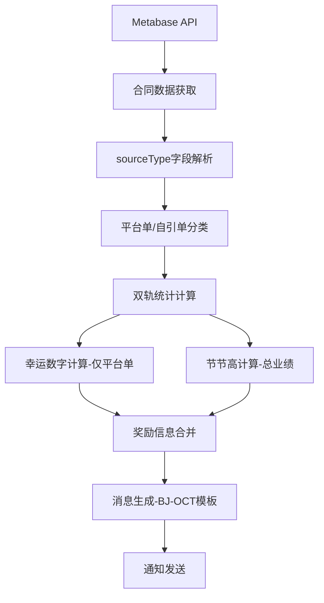

# 北京2025年10月销售激励活动技术设计文档

## 1. 项目概述

### 1.1 活动背景
北京2025年10月销售激励活动是在现有新架构基础上的业务扩展，需要结合北京9月份的基础逻辑和上海9月份的双轨统计特性，实现一个混合型的激励方案。

### 1.2 技术目标
- 基于新架构核心模块实现北京10月活动
- 最小化代码修改，通过配置驱动实现业务差异化
- 保持与现有系统的完全兼容性
- 复用上海双轨统计的成熟逻辑

### 1.3 核心特性
- **双轨统计**：支持平台单和自引单的分别统计
- **混合奖励**：幸运数字基于平台单，节节高基于总业绩
- **专用消息**：结合北京和上海特色的消息模板
- **无历史合同**：简化数据处理，不涉及历史工单计算

## 2. 需求分析

### 2.1 业务需求对比

| 需求项目 | 北京9月 | 上海9月 | 北京10月 |
|----------|---------|---------|----------|
| **幸运数字** | 个人序号5倍数 | 无 | 平台单个人序号5倍数 |
| **节节高计算** | 仅平台单 | 仅平台单 | 平台单+自引单总计 |
| **合同门槛** | 10个合同 | 5个合同 | 10个合同（总计） |
| **双轨统计** | 不支持 | 支持 | 支持 |
| **历史合同** | 支持 | 不支持 | 不支持 |
| **合同上限** | 5万元 | 无上限 | **平台单5万，自引单20万** |
| **工单上限** | 5万元 | 无上限 | **平台单5万，自引单20万** |
| **业绩金额显示** | 支持 | 不支持 | **支持** |

### 2.2 关键业务逻辑

#### 2.2.1 幸运数字逻辑
```
条件：管家个人平台单数量 % 5 == 0
奖励：接好运 58元
说明：只计算平台单的个人序号，不包含自引单
```

#### 2.2.2 节节高逻辑
```
门槛：10个合同（平台单+自引单累计）
计算：基于总业绩金额（平台单金额+自引单金额）
奖励：达标奖(10万)、优秀奖(18万)、精英奖(30万)、卓越奖(46万)
```

#### 2.2.3 任务消息格式
```
🧨🧨🧨 签约喜报 🧨🧨🧨

恭喜 【管家姓名】 签约合同（【工单类型】） 【合同编号】 并完成线上收款🎉🎉🎉

🌻 本单为平台本月累计签约第 【平台+自引】 单

🌻 个人平台单累计签约第 【】 单，累计签约 【】 元
🌻 个人自引单累计签约第 【】 单，累计签约 【】元
🌻 个人累计业绩金额 【】 元

👊 距离 精英奖 还需 【】 元 🎉🎉🎉
```

**消息格式说明**：
- 第一行显示工单类型（平台单/自引单）
- 第二行显示总累计签约单数（平台单+自引单）
- 分别显示平台单和自引单的数量和金额统计
- **新增**：显示个人累计业绩金额（与北京9月保持一致）
- 最后一行动态生成，逻辑与当前北京一致

#### 2.2.4 重要业务逻辑差异 ⚠️

**与上海9月的关键差异**：
- **上海9月**: 自引单不参与节节高，有独立奖励体系
- **北京10月**: 自引单参与节节高，无独立奖励体系

**消息备注逻辑影响**：
- **上海9月**: 自引单显示"继续加油，争取更多奖励"（独立奖励逻辑）
- **北京10月**: 自引单和平台单都显示节节高奖励进度信息（统一逻辑）

**技术实现差异**：
```python
# 上海9月逻辑（错误示例）
if order_type == "自引单":
    next_msg = '继续加油，争取更多奖励'  # 独立奖励

# 北京10月逻辑（正确实现）
remarks = record.get("备注", "")
if '无' in remarks:
    next_msg = '恭喜已经达成所有奖励，祝愿再接再厉，再创佳绩'
else:
    next_msg = remarks  # 统一显示节节高进度
```

## 3. 技术架构设计

### 3.1 新架构适配方案

#### 3.1.1 核心设计原则
- **配置驱动**：通过 `BJ-2025-10` 配置实现业务逻辑
- **模块复用**：复用双轨统计、奖励计算等核心模块
- **最小修改**：仅在必要的扩展点添加新逻辑
- **向后兼容**：不影响现有北京9月和上海9月的功能

#### 3.1.2 架构组件映射

| 新架构组件 | 北京10月适配 | 修改类型 |
|------------|-------------|----------|
| **ProcessingConfig** | 启用dual_track | 配置修改 |
| **RewardCalculator** | 扩展platform_only幸运数字 | 代码扩展 |
| **NotificationService** | 添加BJ-OCT消息模板 | 代码扩展 |
| **DataProcessingPipeline** | 复用现有逻辑 | 无修改 |
| **PerformanceDataStore** | 复用现有逻辑 | 无修改 |

### 3.2 数据流设计



## 4. 详细设计

### 4.1 配置文件设计

#### 4.1.1 BJ-2025-10配置
```python
"BJ-2025-10": {
    "lucky_number": "5",
    "lucky_number_mode": "personal_sequence",
    "lucky_number_sequence_type": "platform_only",  # 新增：仅基于平台单
    "lucky_rewards": {
        "base": {"name": "接好运", "threshold": 0},
        "high": {"name": "接好运", "threshold": 999999999}
    },
    "performance_limits": {
        "single_project_limit": 50000,  # 平台单工单上限5万
        "enable_cap": True,
        "single_contract_cap": 50000,  # 平台单合同上限5万
        # 新增：差异化金额上限配置
        "self_referral_contract_cap": 200000,  # 自引单合同上限20万
        "self_referral_project_limit": 200000   # 自引单工单上限20万
    },
    "tiered_rewards": {
        "min_contracts": 10,  # 平台单+自引单累计
        "tiers": [
            {"name": "达标奖", "threshold": 100000},
            {"name": "优秀奖", "threshold": 180000},
            {"name": "精英奖", "threshold": 300000},
            {"name": "卓越奖", "threshold": 460000}
        ]
    },
    "awards_mapping": {
        "接好运": "58",
        "达标奖": "200",
        "优秀奖": "400",
        "精英奖": "800",
        "卓越奖": "1600"
    },
    # 自引单奖励配置（北京10月不启用）
    "self_referral_rewards": {
        "enable": False  # 北京10月不需要自引单独立奖励
    },
    "reward_calculation_strategy": {
        "type": "dual_track",  # 启用双轨统计
        "rules": {
            "default": {
                "enable_tiered_rewards": True,
                "stats_source": "total"  # 节节高使用总统计
            }
        }
    },
    "badge_config": {
        "enable_elite_badge": False,
        "enable_rising_star_badge": False
    }
}
```

### 4.2 代码修改方案

#### 4.2.1 RewardCalculator扩展
**文件**: `modules/core/reward_calculator.py`

**修改点**: `_determine_lucky_number_reward` 方法
```python
def _determine_lucky_number_reward(self, contract_data: ContractData, 
                                  housekeeper_stats: HousekeeperStats,
                                  global_sequence: int = None, 
                                  personal_sequence: int = None) -> tuple:
    lucky_number_str = self.config.get("lucky_number", "5")
    lucky_sequence_type = self.config.get("lucky_number_sequence_type", "personal")
    
    if not lucky_number_str:
        return "", ""
    
    try:
        lucky_number = int(lucky_number_str)
    except (ValueError, TypeError):
        return "", ""
    
    # 新增：支持仅基于平台单序号的幸运数字计算
    if lucky_sequence_type == "platform_only":
        # 使用平台单的个人序号
        platform_sequence = housekeeper_stats.platform_count
        if platform_sequence > 0 and platform_sequence % lucky_number == 0:
            return "幸运数字", "接好运"
    elif lucky_sequence_type == "personal":
        # 原有逻辑：使用总的个人序号
        total_sequence = housekeeper_stats.total_count
        if total_sequence > 0 and total_sequence % lucky_number == 0:
            return "幸运数字", "接好运"
    
    return "", ""
```

#### 4.2.2 NotificationService扩展
**文件**: `modules/core/notification_service.py`

**修改点**: `_send_group_notification` 方法
```python
def _send_group_notification(self, record: Dict):
    service_housekeeper = record['管家(serviceHousekeeper)']
    
    # 处理徽章逻辑（北京地区）
    if self.config.city.value == "BJ":
        service_housekeeper = self._apply_badge_logic(service_housekeeper)
    
    # 北京10月专用消息模板
    if self.config.config_key == "BJ-2025-10":
        order_type = record.get("工单类型", "平台单")
        platform_count = record.get("平台单累计数量", 0)
        self_referral_count = record.get("自引单累计数量", 0)
        platform_amount = self._format_amount(record.get("平台单累计金额", 0))
        self_referral_amount = self._format_amount(record.get("自引单累计金额", 0))
        
        # 计算总合同数
        total_count = platform_count + self_referral_count
        
        # 备注逻辑 - 北京10月：自引单和平台单都参与节节高，使用相同逻辑
        remarks = record.get("备注", "")
        if '无' in remarks:
            next_msg = '恭喜已经达成所有奖励，祝愿再接再厉，再创佳绩'
        else:
            next_msg = remarks  # 无论平台单还是自引单，都显示节节高奖励进度
        
        msg = f'''🧨🧨🧨 签约喜报 🧨🧨🧨

恭喜 {service_housekeeper} 签约合同（{order_type}） {record.get("合同编号(contractdocNum)", "")} 并完成线上收款🎉🎉🎉

🌻 本单为平台本月累计签约第 {total_count} 单

🌻 个人平台单累计签约第 {platform_count} 单，累计签约 {platform_amount} 元
🌻 个人自引单累计签约第 {self_referral_count} 单，累计签约 {self_referral_amount}元
🌻 个人累计业绩金额 {performance_amount} 元

👊 {next_msg} 🎉🎉🎉
'''
    else:
        # 其他配置使用原有逻辑
        # ... 现有代码 ...
    
    # 创建群通知任务
    group_name = WECOM_GROUP_NAME_BJ if self.config.city.value == "BJ" else WECOM_GROUP_NAME_SH
    create_task('send_wecom_message', group_name, msg)
```

#### 4.2.3 Beijing Jobs扩展
**文件**: `modules/core/beijing_jobs.py`

**新增函数**: `signing_and_sales_incentive_oct_beijing_v2`
```python
def signing_and_sales_incentive_oct_beijing_v2() -> List[PerformanceRecord]:
    """
    北京2025年10月销售激励任务（新架构）
    
    特点：
    - 启用双轨统计（平台单+自引单）
    - 幸运数字基于平台单个人序号
    - 节节高基于总业绩
    - 不处理历史合同
    """
    logging.info("开始执行北京10月销售激励任务（重构版）")
    
    try:
        # 创建处理管道
        pipeline, config, store = create_standard_pipeline(
            config_key="BJ-2025-10",
            activity_code="BJ-OCT",
            city="BJ",
            housekeeper_key_format="管家",
            storage_type="sqlite",
            enable_dual_track=True,  # 启用双轨统计
            enable_project_limit=True,
            enable_historical_contracts=False,  # 不处理历史合同
            db_path="performance_data.db"
        )
        
        logging.info(f"创建处理管道成功: {config.activity_code}")
        
        # 获取合同数据
        contract_data = _get_contract_data_from_metabase_oct()
        logging.info(f"获取到 {len(contract_data)} 个合同数据")
        
        # 处理数据
        processed_records = pipeline.process(contract_data)
        logging.info(f"处理完成: {len(processed_records)} 条记录")
        
        # 生成输出和发送通知
        if config.enable_csv_output:
            csv_file = _generate_csv_output(processed_records, config)
            logging.info(f"生成CSV文件: {csv_file}")
        _send_notifications(processed_records, config)
        
        return processed_records
        
    except Exception as e:
        logging.error(f"北京10月任务执行失败: {e}")
        raise
```

## 5. 实施计划

### 5.1 开发步骤

#### 阶段1：配置和基础代码修改（1-2天）
1. 修改 `modules/config.py` 中的 `BJ-2025-10` 配置
2. 扩展 `RewardCalculator` 的幸运数字计算逻辑
3. 扩展 `NotificationService` 的消息模板

#### 阶段2：Job函数开发（1天）
1. 创建 `signing_and_sales_incentive_oct_beijing_v2` 函数
2. 实现数据获取逻辑
3. 集成处理管道

#### 阶段3：测试验证（2-3天）
1. 单元测试：配置解析、奖励计算、消息生成
2. 集成测试：完整数据流测试
3. 对比测试：与预期结果对比

#### 阶段4：部署上线（1天）
1. 代码审查和合并
2. 生产环境部署
3. 监控和验证

### 5.2 测试策略

#### 5.2.1 单元测试
- 幸运数字计算逻辑测试
- 双轨统计计算测试
- 消息模板生成测试
- 配置解析测试

#### 5.2.2 集成测试
- 完整数据处理流程测试
- 通知发送流程测试
- 数据库存储测试

#### 5.2.3 业务验证
- 使用真实数据进行端到端测试
- 与业务方确认消息格式
- 验证奖励计算逻辑

## 6. 风险评估与缓解

### 6.1 技术风险

#### 6.1.1 数据源兼容性风险
**风险**：北京10月API数据源可能缺少 `sourceType` 字段
**影响**：无法区分平台单和自引单
**缓解**：
- 提前确认数据源字段
- 准备字段映射方案
- 设计默认值处理逻辑

#### 6.1.2 幸运数字计算边界风险
**风险**：管家只有自引单时，平台单序号为0可能导致计算异常
**影响**：幸运数字奖励计算错误
**缓解**：
- 添加边界条件检查
- 确保序号大于0才计算
- 充分的边界测试

#### 6.1.3 消息模板兼容性风险
**风险**：新消息模板可能与现有通知系统不兼容
**影响**：消息发送失败或格式错误
**缓解**：
- 基于现有模板进行扩展
- 保持字段命名一致性
- 充分的消息格式测试

### 6.2 业务风险

#### 6.2.1 奖励计算逻辑风险
**风险**：节节高计算逻辑可能与业务预期不符
**影响**：奖励发放错误
**缓解**：
- 与业务方详细确认计算规则
- 使用真实数据进行验证
- 建立业务验收标准

#### 6.2.2 消息内容风险
**风险**：消息格式可能不符合业务要求
**影响**：用户体验不佳
**缓解**：
- 提前与业务方确认消息模板
- 进行消息格式预览
- 支持快速调整机制

## 7. 关键实现细节

### 7.1 数据源字段映射

#### 7.1.1 必需字段确认
基于现有上海9月的实现，北京10月需要以下关键字段：

```python
# 必需字段列表
REQUIRED_FIELDS = {
    '合同ID(_id)': '合同唯一标识',
    '管家(serviceHousekeeper)': '管家姓名',
    '服务商(orgName)': '服务商名称',
    '合同金额(adjustRefundMoney)': '合同金额',
    '支付金额(paidAmount)': '支付金额',
    '工单类型(sourceType)': '1=自引单, 2=平台单',  # 关键字段
    '合同编号(contractdocNum)': '合同编号',
    '项目地址(projectAddress)': '项目地址（自引单去重用）',
    '转化率(conversion)': '转化率信息'
}
```

#### 7.1.2 字段处理逻辑
```python
def _process_contract_data(raw_data):
    """处理合同数据，确保字段完整性"""
    # 工单类型处理
    source_type = int(raw_data.get('工单类型(sourceType)', 2))  # 默认平台单
    order_type = OrderType.SELF_REFERRAL if source_type == 1 else OrderType.PLATFORM

    # 项目地址处理（自引单去重用）
    project_address = raw_data.get('项目地址(projectAddress)', '')

    return ContractData(
        contract_id=raw_data['合同ID(_id)'],
        housekeeper=raw_data['管家(serviceHousekeeper)'],
        service_provider=raw_data.get('服务商(orgName)', ''),
        contract_amount=float(raw_data['合同金额(adjustRefundMoney)']),
        paid_amount=float(raw_data.get('支付金额(paidAmount)', 0)),
        order_type=order_type,
        raw_data=raw_data
    )
```

### 7.2 奖励计算核心逻辑

#### 7.2.1 幸运数字计算详细实现
```python
def _calculate_platform_only_lucky_reward(self, housekeeper_stats: HousekeeperStats,
                                         lucky_number: int) -> tuple:
    """
    基于平台单个人序号的幸运数字计算

    Args:
        housekeeper_stats: 管家统计数据
        lucky_number: 幸运数字（5）

    Returns:
        tuple: (reward_type, reward_name)
    """
    platform_count = housekeeper_stats.platform_count

    # 边界检查
    if platform_count <= 0:
        return "", ""

    # 幸运数字判断
    if platform_count % lucky_number == 0:
        logging.info(f"幸运数字触发: 平台单序号 {platform_count} 是 {lucky_number} 的倍数")
        return "幸运数字", "接好运"

    return "", ""
```

#### 7.2.2 节节高计算逻辑
```python
def _calculate_tiered_rewards_total(self, housekeeper_stats: HousekeeperStats,
                                   config: Dict) -> List[RewardInfo]:
    """
    基于总业绩的节节高奖励计算

    Args:
        housekeeper_stats: 管家统计数据
        config: 奖励配置

    Returns:
        List[RewardInfo]: 奖励信息列表
    """
    rewards = []

    # 使用总统计数据
    total_contracts = housekeeper_stats.total_count
    total_amount = housekeeper_stats.total_amount

    min_contracts = config.get("tiered_rewards", {}).get("min_contracts", 10)
    tiers = config.get("tiered_rewards", {}).get("tiers", [])

    # 合同数量门槛检查
    if total_contracts < min_contracts:
        logging.info(f"未达到合同门槛: {total_contracts}/{min_contracts}")
        return rewards

    # 按阈值从高到低检查
    for tier in sorted(tiers, key=lambda x: x["threshold"], reverse=True):
        if total_amount >= tier["threshold"]:
            reward = RewardInfo(
                reward_type="节节高",
                reward_name=tier["name"],
                description=f"总业绩 {total_amount} 元达到 {tier['threshold']} 元门槛"
            )
            rewards.append(reward)
            break

    return rewards
```

### 7.3 消息生成详细实现

#### 7.3.1 消息数据准备
```python
def _prepare_message_data(self, record: Dict) -> Dict:
    """准备消息生成所需的数据"""
    # 基础信息
    housekeeper = record['管家(serviceHousekeeper)']
    contract_num = record.get("合同编号(contractdocNum)", "")
    order_type = record.get("工单类型", "平台单")

    # 双轨统计数据
    platform_count = record.get("平台单累计数量", 0)
    self_referral_count = record.get("自引单累计数量", 0)
    platform_amount = self._format_amount(record.get("平台单累计金额", 0))
    self_referral_amount = self._format_amount(record.get("自引单累计金额", 0))

    # 计算总数
    total_count = platform_count + self_referral_count

    # 备注处理 - 北京10月：自引单和平台单都参与节节高，使用相同逻辑
    remarks = record.get("备注", "")
    if '无' in remarks:
        next_msg = '恭喜已经达成所有奖励，祝愿再接再厉，再创佳绩'
    else:
        next_msg = remarks  # 无论平台单还是自引单，都显示节节高奖励进度

    return {
        'housekeeper': housekeeper,
        'contract_num': contract_num,
        'order_type': order_type,
        'platform_count': platform_count,
        'self_referral_count': self_referral_count,
        'platform_amount': platform_amount,
        'self_referral_amount': self_referral_amount,
        'total_count': total_count,
        'next_msg': next_msg
    }
```

#### 7.3.2 消息模板渲染
```python
def _render_beijing_october_message(self, data: Dict) -> str:
    """渲染北京10月专用消息模板"""
    return f'''🧨🧨🧨 签约喜报 🧨🧨🧨

恭喜 {data['housekeeper']} 签约合同（{data['order_type']}） {data['contract_num']} 并完成线上收款🎉🎉🎉

🌻 本单为平台本月累计签约第 {data['total_count']} 单

🌻 个人平台单累计签约第 {data['platform_count']} 单，累计签约 {data['platform_amount']} 元
🌻 个人自引单累计签约第 {data['self_referral_count']} 单，累计签约 {data['self_referral_amount']}元

👊 {data['next_msg']} 🎉🎉🎉
'''
```

## 8. 测试验证方案

### 8.1 单元测试用例

#### 8.1.1 幸运数字计算测试
```python
def test_platform_only_lucky_number():
    """测试仅基于平台单的幸运数字计算"""
    # 测试用例1：平台单序号为5的倍数
    stats1 = HousekeeperStats(platform_count=5, self_referral_count=3)
    result1 = calculator._calculate_platform_only_lucky_reward(stats1, 5)
    assert result1 == ("幸运数字", "接好运")

    # 测试用例2：平台单序号不是5的倍数
    stats2 = HousekeeperStats(platform_count=7, self_referral_count=3)
    result2 = calculator._calculate_platform_only_lucky_reward(stats2, 5)
    assert result2 == ("", "")

    # 测试用例3：只有自引单，无平台单
    stats3 = HousekeeperStats(platform_count=0, self_referral_count=5)
    result3 = calculator._calculate_platform_only_lucky_reward(stats3, 5)
    assert result3 == ("", "")
```

#### 8.1.2 节节高计算测试
```python
def test_total_tiered_rewards():
    """测试基于总业绩的节节高奖励"""
    config = {
        "tiered_rewards": {
            "min_contracts": 10,
            "tiers": [
                {"name": "达标奖", "threshold": 100000},
                {"name": "优秀奖", "threshold": 180000}
            ]
        }
    }

    # 测试用例1：达到合同门槛和金额门槛
    stats1 = HousekeeperStats(
        platform_count=6, self_referral_count=4,  # 总计10个
        platform_amount=80000, self_referral_amount=30000  # 总计11万
    )
    rewards1 = calculator._calculate_tiered_rewards_total(stats1, config)
    assert len(rewards1) == 1
    assert rewards1[0].reward_name == "达标奖"

    # 测试用例2：未达到合同门槛
    stats2 = HousekeeperStats(
        platform_count=5, self_referral_count=3,  # 总计8个
        platform_amount=80000, self_referral_amount=30000
    )
    rewards2 = calculator._calculate_tiered_rewards_total(stats2, config)
    assert len(rewards2) == 0
```

### 8.2 集成测试方案

#### 8.2.1 端到端测试
```python
def test_beijing_october_end_to_end():
    """北京10月完整流程测试"""
    # 准备测试数据
    test_contracts = [
        {
            '合同ID(_id)': 'BJ-OCT-001',
            '管家(serviceHousekeeper)': '张三',
            '工单类型(sourceType)': 2,  # 平台单
            '合同金额(adjustRefundMoney)': 50000,
            # ... 其他字段
        },
        {
            '合同ID(_id)': 'BJ-OCT-002',
            '管家(serviceHousekeeper)': '张三',
            '工单类型(sourceType)': 1,  # 自引单
            '合同金额(adjustRefundMoney)': 30000,
            # ... 其他字段
        }
    ]

    # 执行处理
    records = signing_and_sales_incentive_oct_beijing_v2()

    # 验证结果
    assert len(records) > 0

    # 验证双轨统计
    zhang_san_records = [r for r in records if r.contract_data.housekeeper == '张三']
    assert len(zhang_san_records) == 2

    # 验证消息生成
    for record in zhang_san_records:
        message_data = notification_service._prepare_message_data(record.to_dict())
        assert 'platform_count' in message_data
        assert 'self_referral_count' in message_data
```

## 9. 部署和监控

### 9.1 部署检查清单

#### 9.1.1 代码部署前检查
- [ ] 配置文件更新完成
- [ ] 单元测试全部通过
- [ ] 集成测试验证完成
- [ ] 代码审查通过
- [ ] 数据源字段确认完成

#### 9.1.2 生产环境验证
- [ ] 数据库连接正常
- [ ] API接口可访问
- [ ] 通知服务正常
- [ ] 日志记录正常
- [ ] 监控指标正常

### 9.2 监控指标

#### 9.2.1 业务指标
- 处理合同数量
- 平台单/自引单比例
- 奖励发放数量
- 消息发送成功率

#### 9.2.2 技术指标
- 处理耗时
- 内存使用量
- 数据库查询性能
- 异常错误率

## 10. 细节问题与决策点

### 10.1 已确认事项 ✅

#### 10.1.1 数据源确认 ✅
- [x] 北京10月API包含 `sourceType` 字段
- [x] `sourceType` 字段的值定义（1=自引单，2=平台单）
- [x] 包含 `projectAddress` 字段用于自引单去重

#### 10.1.2 业务规则确认 ✅
- [x] 自引单不需要独立奖励（与上海9月不同）
- [x] 幸运数字奖励只基于平台单序号
- [x] 节节高门槛为10个合同（平台单+自引单）

#### 10.1.3 消息格式确认 ✅
- [x] 消息模板格式已确认（见2.2.3节）
- [x] 不需要显示转化率信息
- [x] 备注信息生成逻辑与当前北京一致

### 10.2 技术决策点

#### 10.2.1 配置策略
**决策**：使用 `dual_track` 策略，但幸运数字使用 `platform_only`
**理由**：既支持双轨统计，又满足幸运数字的特殊需求

#### 10.2.2 消息模板策略
**决策**：为北京10月创建专用消息模板
**理由**：避免影响现有系统，提供最大的灵活性

#### 10.2.3 代码扩展策略
**决策**：在现有模块中添加扩展点，而不是创建新模块
**理由**：最小化架构变更，保持系统一致性

### 10.3 后续优化建议

#### 10.3.1 配置管理优化
- 考虑将消息模板也配置化
- 建立配置验证机制
- 支持配置热更新

#### 10.3.2 测试框架优化
- 建立自动化测试套件
- 支持业务场景测试
- 建立性能基准测试

#### 10.3.3 监控告警优化
- 添加业务指标监控
- 建立异常告警机制
- 支持实时数据验证

## 11. 总结与下一步行动

### 11.1 技术设计总结

本技术设计文档基于对新架构的深入分析，为北京2025年10月销售激励活动提供了完整的实现方案。核心设计理念是：

1. **最大化复用**：充分利用新架构的配置驱动和模块化设计
2. **最小化修改**：仅在必要的扩展点添加新逻辑
3. **业务适配**：通过配置和模板实现北京10月的特殊需求
4. **系统兼容**：确保不影响现有北京9月和上海9月的功能

### 11.2 关键创新点

1. **混合奖励策略**：首次实现幸运数字基于平台单、节节高基于总业绩的混合计算
2. **专用消息模板**：结合北京和上海特色，创建北京10月专用消息格式
3. **配置扩展**：引入 `lucky_number_sequence_type: platform_only` 新配置项
4. **双轨统计适配**：在北京地区首次启用双轨统计功能

### 11.3 立即行动项

#### 高优先级（本周完成）
1. **数据源确认**：与数据团队确认北京10月API的 `sourceType` 字段
2. **业务规则确认**：与业务方确认消息模板和奖励计算细节
3. **配置文件更新**：完成 `modules/config.py` 中 `BJ-2025-10` 配置的修改

#### 中优先级（下周完成）
1. **核心代码开发**：实现 `RewardCalculator` 和 `NotificationService` 的扩展
2. **Job函数开发**：创建 `signing_and_sales_incentive_oct_beijing_v2` 函数
3. **单元测试编写**：完成关键逻辑的单元测试

#### 低优先级（后续完成）
1. **集成测试**：端到端测试验证
2. **性能优化**：监控和性能调优
3. **文档完善**：用户手册和运维文档

### 11.4 风险提醒

1. **数据源风险**：如果北京10月API缺少关键字段，需要协调数据源修改
2. **业务逻辑风险**：消息格式和奖励计算需要与业务方充分确认
3. **测试覆盖风险**：双轨统计的复杂性要求充分的测试验证
4. **上线时间风险**：建议预留充足的测试和验证时间

---

**文档版本**: v1.0
**创建日期**: 2025-01-28
**最后更新**: 2025-01-28
**作者**: 技术团队
**审核状态**: 待审核

**下次审核**: 数据源确认后更新至v1.1版本
