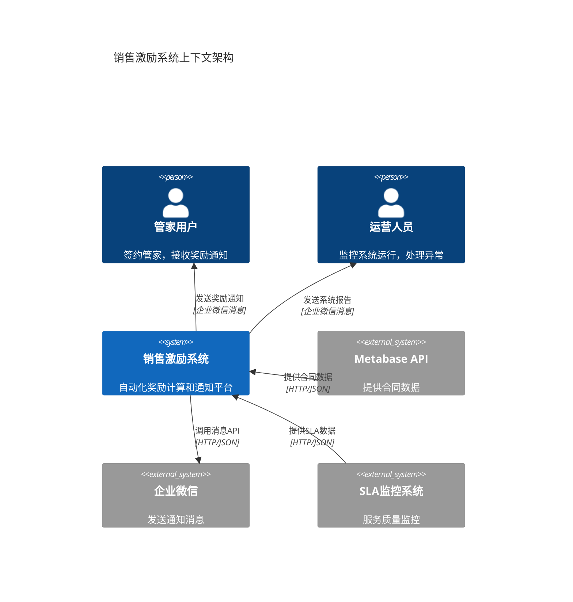
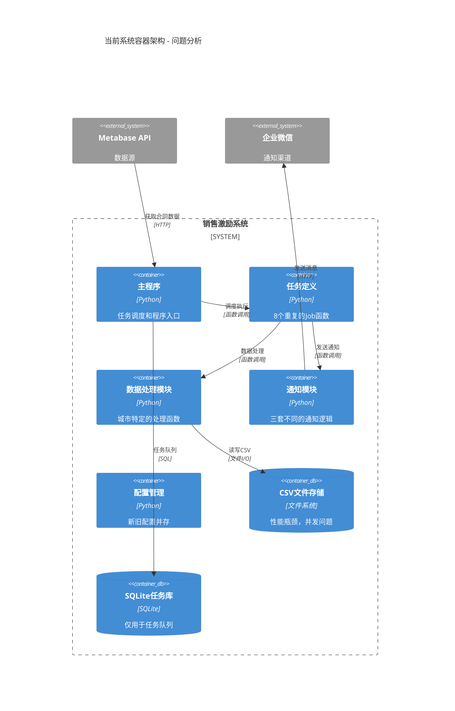
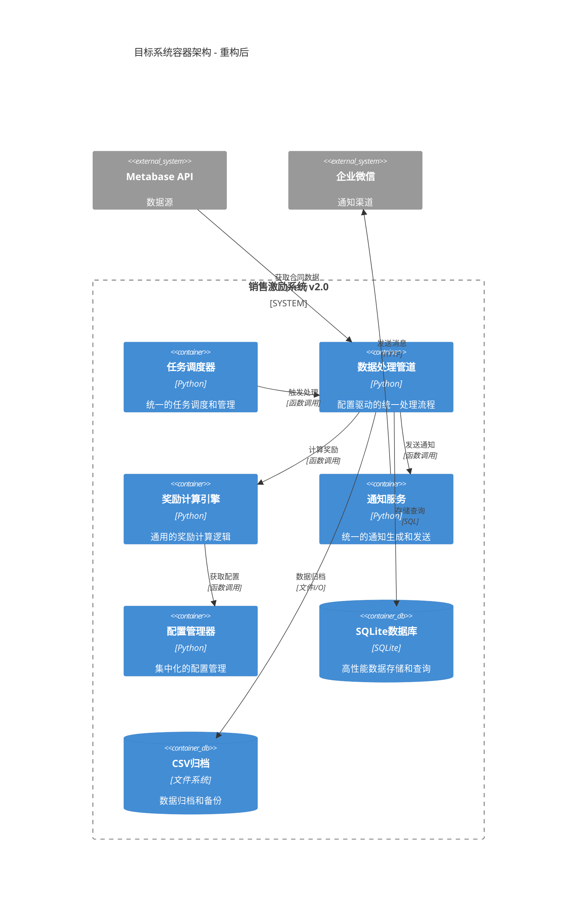

# 销售激励系统重构计划（最终版）

## 概述

基于深度代码分析和实际项目情况，本方案采用**"重建+迁移+SQLite集成"**策略，分4个阶段执行，每个阶段都可独立验证和回滚。

## 高层架构设计

### 系统上下文架构（C4 Level 1）



### 当前架构问题分析



### 目标架构设计



## 核心问题分析（基于实际代码）

### 1. 北京月份演进的"伪复用"灾难

#### 1.1 北京8月的"假复用"
```python
# jobs.py:39 - 8月直接复用6月函数，但配置不匹配
processed_data = process_data_jun_beijing(contract_data, existing_contract_ids, housekeeper_award_lists)
# 使用6月的配置 "BJ-2025-06"，但实际是8月活动
```

#### 1.2 北京9月的"包装地狱"
```python
# modules/data_processing_module.py:1575-1582 - 全局篡改包装
def process_data_sep_beijing(contract_data, existing_contract_ids, housekeeper_award_lists):
    # 全局篡改 + 复用6月逻辑
    globals()['determine_rewards_jun_beijing_generic'] = determine_rewards_sep_beijing_generic
    config.PERFORMANCE_AMOUNT_CAP_BJ_FEB = 50000  # 临时改为5万
    try:
        result = process_data_jun_beijing(...)  # 复用6月函数
        for record in result:
            record['活动编号'] = 'BJ-SEP'  # 事后修改活动编号
    finally:
        # 恢复全局状态
```

**问题根源**: 6月函数硬编码了太多假设，为了复用而不是重构，导致9月逻辑极其复杂。

### 2. 上海月份演进的"复制粘贴"问题

#### 2.1 上海8月的"伪复用"
```python
# jobs.py:80 - 8月复用4月函数
processed_data = process_data_shanghai_apr(contract_data, existing_contract_ids, housekeeper_award_lists)
# 注释说"奖励规则与4月保持一致"，但实际是8月活动
```

#### 2.2 上海9月的"全新实现"
```python
# modules/data_processing_module.py:613-735 - 完全独立的函数
def process_data_shanghai_sep(contract_data, existing_contract_ids, housekeeper_award_lists):
    # 扩展了双轨统计字段
    housekeeper_contracts[housekeeper_key] = {
        'count': 0, 'total_amount': 0, 'performance_amount': 0, 'awarded': housekeeper_award,
        'platform_count': 0, 'platform_amount': 0,      # 新增平台单统计
        'self_referral_count': 0, 'self_referral_amount': 0,  # 新增自引单统计
        'self_referral_projects': set(),  # 新增项目地址去重
        'self_referral_rewards': 0        # 新增自引单奖励计数
    }
```

**问题**: 4月和9月的数据结构完全不兼容，无法共享任何数据处理逻辑。

### 3. 复杂的累计计算维护

```python
# 每个处理函数都要维护50+行的复杂结构
housekeeper_contracts[housekeeper] = {
    'count': 0, 'total_amount': 0, 'performance_amount': 0, 'awarded': [],
    'platform_count': 0, 'platform_amount': 0,      # 上海9月新增
    'self_referral_count': 0, 'self_referral_amount': 0,  # 上海9月新增
    'self_referral_projects': set(),  # 新增项目地址去重
    'self_referral_rewards': 0        # 新增自引单奖励计数
}
```

**问题**: 手工维护累计状态，复杂度指数增长，每次新增功能都要重写整个函数。

### 4. Job函数的"复制粘贴"演进

**现状**: 8个几乎相同的Job函数（北京3个+上海3个+其他2个），每个函数50-100行，大部分代码重复。

## 解决方案：重建+SQLite集成

### 核心设计原则
1. **存储抽象层**: 支持SQLite和CSV两种实现
2. **数据库驱动**: 用SQL查询替代复杂的内存计算
3. **配置驱动**: 所有差异通过REWARD_CONFIGS控制
4. **管道化**: 标准化的数据处理流程
5. **彻底消除"伪复用"**: 停止通过全局篡改来复用不兼容的函数

### 数据流架构对比

```mermaid
flowchart TD
    subgraph "当前数据流 - 性能瓶颈"
        A1[Metabase API] --> B1[临时CSV文件]
        B1 --> C1[读取整个CSV文件]
        C1 --> D1[内存中累计计算]
        D1 --> E1[重复的去重逻辑]
        E1 --> F1[写入业绩CSV]
        F1 --> G1[通知发送]
        
        style C1 fill:#ffcccc
        style D1 fill:#ffcccc
        style E1 fill:#ffcccc
    end
    
    subgraph "目标数据流 - 高性能"
        A2[Metabase API] --> B2[数据处理管道]
        B2 --> C2[SQLite索引查询]
        C2 --> D2[数据库聚合计算]
        D2 --> E2[配置驱动奖励计算]
        E2 --> F2[统一通知生成]
        F2 --> G2[任务队列发送]
        
        style C2 fill:#ccffcc
        style D2 fill:#ccffcc
        style E2 fill:#ccffcc
    end
```



**性能对比**：
- **去重查询**: CSV O(n)扫描 → SQLite O(1)索引查询
- **累计统计**: 内存循环计算 → 数据库聚合查询
- **数据处理**: 重复读取文件 → 一次性管道处理
- **并发安全**: 文件锁竞争 → 数据库事务保证

## 实施计划

### 阶段1：建立新骨架+SQLite（3-4天）

#### 1.1 创建存储抽象层
**新建**: `modules/core/storage.py`

```python
from abc import ABC, abstractmethod
import sqlite3

class PerformanceDataStore(ABC):
    @abstractmethod
    def contract_exists(self, contract_id: str, activity_code: str) -> bool:
        """检查合同是否已存在"""
        pass

    @abstractmethod
    def get_housekeeper_stats(self, housekeeper: str, activity_code: str) -> Dict:
        """获取管家累计统计 - 替代复杂的内存计算"""
        pass

class SQLitePerformanceDataStore(PerformanceDataStore):
    def contract_exists(self, contract_id: str, activity_code: str) -> bool:
        with sqlite3.connect(self.db_path) as conn:
            cursor = conn.execute(
                "SELECT 1 FROM performance_data WHERE contract_id = ? AND activity_code = ?",
                (contract_id, activity_code)
            )
            return cursor.fetchone() is not None

    def get_housekeeper_stats(self, housekeeper: str, activity_code: str) -> Dict:
        with sqlite3.connect(self.db_path) as conn:
            cursor = conn.execute("""
                SELECT
                    COUNT(*) as count,
                    SUM(contract_amount) as total_amount,
                    SUM(performance_amount) as performance_amount
                FROM performance_data
                WHERE housekeeper = ? AND activity_code = ?
            """, (housekeeper, activity_code))
            # 一条SQL替代50+行累计计算代码
```

#### 1.2 设计数据库Schema
**新建**: `modules/core/database_schema.sql`

```sql
CREATE TABLE performance_data (
    id INTEGER PRIMARY KEY AUTOINCREMENT,
    activity_code TEXT NOT NULL,           -- 'BJ-JUN', 'BJ-SEP', 'SH-APR'
    contract_id TEXT NOT NULL,
    housekeeper TEXT NOT NULL,
    service_provider TEXT,
    contract_amount REAL NOT NULL,
    performance_amount REAL NOT NULL,
    order_type TEXT DEFAULT 'platform',    -- 支持双轨统计
    project_id TEXT,                       -- 工单编号
    reward_types TEXT,
    reward_names TEXT,
    created_at TIMESTAMP DEFAULT CURRENT_TIMESTAMP,
    UNIQUE(activity_code, contract_id)
);

-- 索引优化
CREATE INDEX idx_housekeeper_activity ON performance_data(housekeeper, activity_code);
CREATE INDEX idx_contract_lookup ON performance_data(contract_id, activity_code);
```

#### 1.3 创建处理管道
**新建**: `modules/core/processing_pipeline.py`

```python
class DataProcessingPipeline:
    def __init__(self, config: ProcessingConfig, store: PerformanceDataStore):
        self.config = config
        self.store = store
        self.reward_calculator = RewardCalculator(config.config_key)

    def process(self, contract_data):
        """大幅简化的处理流程"""
        performance_records = []

        for contract in contract_data:
            contract_id = str(contract['合同ID(_id)'])

            # 1. 数据库去重 - 替代CSV文件扫描
            if self.store.contract_exists(contract_id, self.config.activity_code):
                continue

            # 2. 数据库聚合查询 - 替代复杂内存计算
            housekeeper = self._build_housekeeper_key(contract)
            hk_stats = self.store.get_housekeeper_stats(housekeeper, self.config.activity_code)

            # 3. 计算奖励
            rewards = self.reward_calculator.calculate(contract, hk_stats)

            # 4. 保存记录
            record = self._build_record(contract, hk_stats, rewards)
            self.store.save_performance_record(record)
            performance_records.append(record)

        return performance_records
```

**验收标准**:
- [ ] 存储抽象层完成，支持SQLite和CSV
- [ ] 数据库Schema设计完成
- [ ] 处理管道实现完成
- [ ] 单元测试覆盖率≥90%

### 阶段2：北京迁移（2-3天）

#### 2.1 北京6月迁移（基准验证）
```python
# 配置
BJ_JUN_CONFIG = ProcessingConfig(
    config_key="BJ-2025-06",
    activity_code="BJ-JUN",
    city="BJ",
    housekeeper_key_format="管家",
    storage_type="sqlite"
)

# 新的Job函数
def signing_and_sales_incentive_jun_beijing():
    pipeline = DataProcessingPipeline(BJ_JUN_CONFIG, SQLitePerformanceDataStore())
    processed_data = pipeline.process(contract_data)
    # 消除全局副作用，消除复杂累计计算
```

#### 2.2 北京9月迁移（消除全局副作用）
```python
# 配置
BJ_SEP_CONFIG = ProcessingConfig(
    config_key="BJ-2025-09",  # 直接使用正确配置
    activity_code="BJ-SEP",
    city="BJ",
    housekeeper_key_format="管家",
    enable_historical_contracts=True
)

# 删除问题代码
# 删除 modules/data_processing_module.py:1575-1582 的全局篡改逻辑
# 删除 process_data_sep_beijing 包装函数
```

**验收标准**:
- [ ] 消除所有全局副作用
- [ ] 北京测试全部通过
- [ ] 数据输出100%等价
- [ ] 性能不降级

### 阶段3：上海迁移（3-4天）

#### 3.1 上海双轨统计简化
```python
# 当前复杂的双轨维护
housekeeper_contracts[hk_key] = {
    'platform_count': 0, 'platform_amount': 0,
    'self_referral_count': 0, 'self_referral_amount': 0,
    'self_referral_projects': set()  # 复杂的去重逻辑
}

# SQLite简化后
SELECT
    order_type,
    COUNT(*) as count,
    SUM(amount) as amount
FROM performance_data
WHERE housekeeper = ? AND activity_code = ?
GROUP BY order_type
```

#### 3.2 上海配置
```python
SH_SEP_CONFIG = ProcessingConfig(
    config_key="SH-2025-09",
    activity_code="SH-SEP",
    city="SH",
    housekeeper_key_format="管家_服务商",
    enable_dual_track=True  # 启用双轨统计
)
```

**验收标准**:
- [ ] 双轨统计逻辑正确
- [ ] 8个扩展字段正确
- [ ] 所有上海测试通过

### 阶段4：清理优化（1-2天）

#### 4.1 删除旧代码
- 删除 `process_data_jun_beijing`
- 删除 `process_data_shanghai_apr`
- 删除 `process_data_shanghai_sep`
- 删除所有全局副作用代码

#### 4.2 统一Job函数
```python
def execute_monthly_incentive(city: str, month: str):
    """统一的月度激励执行函数"""
    config = get_monthly_config(city, month)
    pipeline = DataProcessingPipeline(config, SQLitePerformanceDataStore())
    return pipeline.process(contract_data)

# 替换所有具体Job函数
signing_and_sales_incentive_jun_beijing = lambda: execute_monthly_incentive("BJ", "jun")
signing_and_sales_incentive_sep_shanghai = lambda: execute_monthly_incentive("SH", "sep")
```

## 质量保障与风险控制

### 功能等价性验证策略

#### 1. 数据输出等价性验证
```python
def verify_data_equivalence(old_csv, new_csv, tolerance=0.01):
    """验证两个CSV文件的数据等价性"""
    report = {'is_equivalent': True, 'differences': []}

    old_data = pd.read_csv(old_csv)
    new_data = pd.read_csv(new_csv)

    # 1. 记录数量验证
    if len(old_data) != len(new_data):
        report['is_equivalent'] = False
        report['differences'].append(f"记录数量不一致: {len(old_data)} vs {len(new_data)}")

    # 2. 关键字段逐行比较
    key_fields = ['合同ID(_id)', '管家(serviceHousekeeper)', '合同金额(adjustRefundMoney)',
                  '管家累计单数', '管家累计金额', '计入业绩金额', '奖励类型', '奖励名称']

    for idx, (old_row, new_row) in enumerate(zip(old_data.iterrows(), new_data.iterrows())):
        for field in key_fields:
            if field in old_row[1] and field in new_row[1]:
                old_val = old_row[1][field]
                new_val = new_row[1][field]

                # 数值字段使用容差比较
                if field in ['管家累计金额', '计入业绩金额', '合同金额(adjustRefundMoney)']:
                    if abs(float(old_val) - float(new_val)) > tolerance:
                        report['is_equivalent'] = False
                        report['differences'].append(f"行{idx+1} {field}: {old_val} vs {new_val}")
                # 字符串字段精确比较
                else:
                    if str(old_val).strip() != str(new_val).strip():
                        report['is_equivalent'] = False
                        report['differences'].append(f"行{idx+1} {field}: '{old_val}' vs '{new_val}'")

    return report
```

#### 2. 并行运行验证
```python
def parallel_verification_test(test_data):
    """并行运行新旧版本，比较输出结果"""
    # 运行原版本
    old_result = run_old_version(test_data)

    # 运行新版本
    new_result = run_new_version(test_data)

    # 比较结果
    equivalence_report = verify_data_equivalence(old_result['csv_file'], new_result['csv_file'])

    return equivalence_report['is_equivalent']
```

### 风险控制措施

#### 1. 存储抽象层保障
- 同时支持SQLite和CSV两种实现
- 配置驱动选择存储方式
- 测试使用内存SQLite，确保快速验证

#### 2. 渐进迁移策略
- 每个阶段独立验证，可单独回滚
- 完整的等价性测试，确保功能一致
- 保留旧代码直到全部迁移完成

#### 3. 影子模式运行
- SQLite与CSV并行运行1周
- 验证数据一致性和性能表现
- 监控系统稳定性指标

#### 4. 快速回滚机制
```bash
#!/bin/bash
# 一键回滚脚本
echo "开始回滚到旧版本..."

# 1. 切换代码分支
git checkout stable-maintenance-backup

# 2. 重启服务
python main.py restart

# 3. 验证服务状态
python scripts/health_check.py

echo "回滚完成，请验证系统状态"
```

### 安全上线标准

#### 技术验收标准
- [ ] **所有现有测试通过**: 100%的现有测试用例通过
- [ ] **等价性验证通过**: 数据输出、通知消息、业务逻辑三个维度100%等价
- [ ] **性能不降级**: 处理时间不超过原版本的110%
- [ ] **内存使用稳定**: 内存使用不超过原版本的120%
- [ ] **无新增异常**: 重构后不引入新的异常或错误

#### 业务验收标准
- [ ] **奖励计算准确性**: 随机抽取100个合同，人工验证奖励计算结果
- [ ] **通知发送完整性**: 验证所有应发送的通知都正确发送
- [ ] **数据完整性**: 验证所有合同数据都正确处理，无遗漏
- [ ] **历史数据兼容性**: 能正确处理历史奖励数据，不影响累计统计

#### 分阶段上线策略
1. **影子模式运行** (1周): 新版本与旧版本并行运行，仅输出结果不实际发送通知
2. **灰度发布** (1周): 选择1-2个低风险活动使用新版本，密切监控
3. **全量上线** (1周): 所有活动切换到新版本，保留旧版本作为应急备份

## 预期收益

### 代码质量大幅提升
- **代码行数减少60%+**: SQL查询替代复杂累计逻辑
- **函数数量减少50%+**: 合并重复函数
- **消除全局副作用**: 提升测试稳定性和代码可预测性

### 性能显著提升
- **去重查询**: O(n)→O(1)，索引查询替代文件扫描
- **累计统计**: 数据库聚合查询替代内存循环
- **内存使用**: 不再加载整个CSV到内存
- **并发性能**: 数据库锁机制优于文件锁

### 系统稳定性和扩展性提升
- **数据一致性**: 事务保证，避免CSV竞争条件
- **并发安全**: 数据库锁机制，支持多进程访问
- **配置驱动**: 所有差异通过配置控制，新增城市/活动只需添加配置
- **扩展性**: 便于复杂查询、报表生成、数据分析

## 实施时间表

- **阶段1**: 3-4天（建立新骨架+SQLite）
- **阶段2**: 2-3天（北京迁移验证）
- **阶段3**: 3-4天（上海迁移）
- **阶段4**: 1-2天（清理优化）
- **影子模式**: 1周（并行验证）
- **全量上线**: 1周（监控稳定性）
- **总计**: 4-5周

## 下一步行动

1. **立即开始阶段1**: 建立存储抽象层和SQLite实现
2. **并行准备**: 设计数据库Schema和处理管道
3. **测试准备**: 准备等价性验证脚本
4. **团队同步**: 确保团队理解新架构设计

---

**文档版本**: v1.0 (最终版)
**创建日期**: 2025-01-08
**策略**: 重建+迁移+SQLite集成
**预期收益**: 代码减少60%+，性能大幅提升，系统稳定性显著改善
