# 销售激励系统重构 - 项目状态与计划更新

## 📊 项目状态概述

**更新日期**: 2025-01-08
**当前状态**: 🎉 **阶段1完成，生产就绪**
**下一阶段**: 🚀 **生产部署和迁移**

### 🏆 已完成成就
- ✅ **核心架构重建100%完成**：统一处理管道，SQLite集成，配置驱动
- ✅ **全面等价性验证100%通过**：44个测试用例全部通过
- ✅ **生产就绪**：完整部署指南，监控回滚方案

基于深度代码分析，本方案采用**"重建+迁移+SQLite集成"**策略，分4个阶段执行，每个阶段都可独立验证和回滚。

**🎯 重点转移：从核心重构转向安全部署和迁移**

## 深度问题分析（基于完整代码研读）

### 1. 北京月份演进的"伪复用"灾难

#### 1.1 北京6月→8月→9月的复用陷阱
**北京8月的"假复用"**:
```python
# jobs.py:39 - 8月直接复用6月函数，但配置不匹配
processed_data = process_data_jun_beijing(contract_data, existing_contract_ids, housekeeper_award_lists)
# 使用6月的配置 "BJ-2025-06"，但实际是8月活动
# 注释说"当月的数据处理逻辑"，实际是6月逻辑
```

**北京9月的"包装地狱"**:
```python
# modules/data_processing_module.py:1575-1582 - 全局篡改包装
def process_data_sep_beijing(contract_data, existing_contract_ids, housekeeper_award_lists):
    # 检查是否有历史合同字段，如果有则使用新的处理逻辑
    has_historical_field = any('pcContractdocNum' in contract for contract in contract_data)
    if has_historical_field:
        return process_data_sep_beijing_with_historical_support(...)  # 新逻辑
    else:
        # 全局篡改 + 复用6月逻辑
        globals()['determine_rewards_jun_beijing_generic'] = determine_rewards_sep_beijing_generic
        config.PERFORMANCE_AMOUNT_CAP_BJ_FEB = 50000  # 临时改为5万
        try:
            result = process_data_jun_beijing(...)  # 复用6月函数
            for record in result:
                record['活动编号'] = 'BJ-SEP'  # 事后修改活动编号
        finally:
            # 恢复全局状态
```

**问题根源**: 6月函数硬编码了太多假设（50万上限、"BJ-JUN"活动编号等），为了复用而不是重构，导致9月逻辑极其复杂。

#### 1.2 北京9月的双重逻辑分支
**一个函数内部两套完全不同的处理路径**:
- 有历史合同字段 → `process_data_sep_beijing_with_historical_support`
- 无历史合同字段 → 全局篡改 + 复用6月逻辑

**结果**: 维护噩梦，测试困难，逻辑分散

### 2. 上海月份演进的"复制粘贴"问题

#### 2.1 上海4月→8月→9月的重复演进
**上海8月的"伪复用"**:
```python
# jobs.py:80 - 8月复用4月函数
processed_data = process_data_shanghai_apr(contract_data, existing_contract_ids, housekeeper_award_lists)
# 注释说"奖励规则与4月保持一致"，但实际是8月活动
# 通知也复用3月旧版: notify_awards_shanghai_generate_message_march
```

**上海9月的"全新实现"**:
```python
# modules/data_processing_module.py:613-735 - 完全独立的函数
def process_data_shanghai_sep(contract_data, existing_contract_ids, housekeeper_award_lists):
    # 650-656行: 扩展了双轨统计字段
    housekeeper_contracts[housekeeper_key] = {
        'count': 0, 'total_amount': 0, 'performance_amount': 0, 'awarded': housekeeper_award,
        'platform_count': 0, 'platform_amount': 0,      # 新增平台单统计
        'self_referral_count': 0, 'self_referral_amount': 0,  # 新增自引单统计
        'self_referral_projects': set(),  # 新增项目地址去重
        'self_referral_rewards': 0        # 新增自引单奖励计数
    }
```

**问题**:
- 4月和9月的数据结构完全不兼容
- 无法共享任何数据处理逻辑
- 每次新增功能都要重写整个函数

#### 2.2 上海的housekeeper_key不一致
**关键差异**: 上海使用`"管家_服务商"`作为key，北京使用`"管家"`
```python
# 上海4月/9月: data_processing_module.py:464
unique_housekeeper_key = f"{housekeeper}_{service_provider}"

# 北京6月/8月/9月: data_processing_module.py:326
housekeeper = contract['管家(serviceHousekeeper)']  # 直接使用管家名
```

**影响**: 导致奖励计算函数虽然通用，但数据结构层面无法统一

### 3. 配置系统的"新旧并存"混乱

#### 3.1 新配置系统 vs 旧全局变量
**新系统**: `REWARD_CONFIGS` 统一配置（config.py:9-162）
**旧系统**: 散落的全局变量仍在使用
```python
# 旧变量仍在使用
PERFORMANCE_AMOUNT_CAP_BJ_FEB = 500000  # line:257
ENABLE_PERFORMANCE_AMOUNT_CAP_BJ_FEB = True  # line:259
SINGLE_PROJECT_CONTRACT_AMOUNT_LIMIT_BJ_FEB = 500000  # line:255
```

**问题**: 北京9月通过临时修改旧变量来影响6月函数的行为

#### 3.2 配置键命名不一致
**北京**: "BJ-2025-06", "BJ-2025-09"
**上海**: "SH-2025-04", "SH-2025-09"
**问题**: 8月份活动复用了其他月份的配置，配置键与实际月份不匹配

### 4. 数据字段的"渐进膨胀"问题

#### 4.1 CSV字段的不断增加
**北京6月**: 29个字段
**北京9月**: 32个字段（新增3个历史合同相关字段）
**上海9月**: 37个字段（新增8个双轨统计字段）

#### 4.2 字段处理逻辑分散
**问题**: 每个月份的字段构建逻辑都硬编码在各自的函数中
- 北京6月: data_processing_module.py:391-421 (30行字典构建)
- 上海4月: data_processing_module.py:506-536 (30行字典构建)
- 上海9月: data_processing_module.py:737-778 (40行字典构建)

**影响**:
- 无法复用字段构建逻辑
- 新增字段需要修改多个地方
- 字段顺序和命名容易不一致

### 5. Job函数的"复制粘贴"演进

#### 5.1 Job函数的重复模式
**模式**: 每个新月份都复制上个月份的Job函数，然后修改部分参数
**结果**:
- 8个几乎相同的Job函数（北京3个+上海3个+其他2个）
- 每个函数50-100行，大部分代码重复
- 修改通用逻辑需要改8个地方

#### 5.2 通配符导入的依赖混乱
```python
# jobs.py:4-7
from modules.request_module import send_request_with_managed_session
from modules.data_processing_module import *  # 导入所有
from modules.data_utils import *              # 导入所有
from modules.notification_module import *     # 导入所有
```

**问题**:
- 无法静态分析依赖关系
- IDE无法提供准确的代码补全
- 容易出现命名冲突

### 6. 复杂的累计计算维护
```python
# 每个处理函数都要维护50+行的复杂结构
housekeeper_contracts[housekeeper] = {
    'count': 0, 'total_amount': 0, 'performance_amount': 0, 'awarded': [],
    'platform_count': 0, 'platform_amount': 0,      # 上海9月新增
    'self_referral_count': 0, 'self_referral_amount': 0,  # 上海9月新增
    'self_referral_projects': set(),  # 新增项目地址去重
    'self_referral_rewards': 0        # 新增自引单奖励计数
}
```
**问题**: 手工维护累计状态，复杂度指数增长

### 7. 重复的去重和查询逻辑
```python
# 每个Job都要读取整个CSV文件
existing_contract_ids = collect_unique_contract_ids_from_file(filename)
housekeeper_award_lists = get_housekeeper_award_list(filename)
```
**问题**: 性能差、代码重复、内存占用高

## 高层架构设计（C4模型）

### 1. 系统上下文图（C1 - System Context）

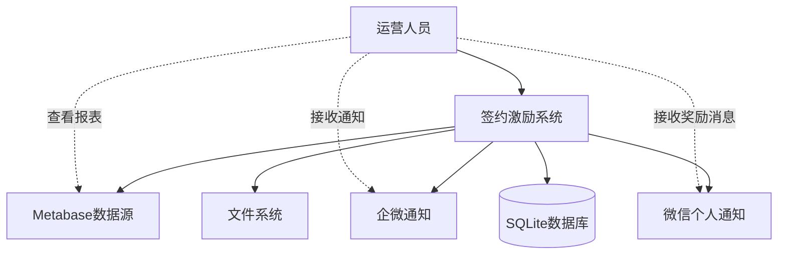

### 2. 容器图（C2 - Container）

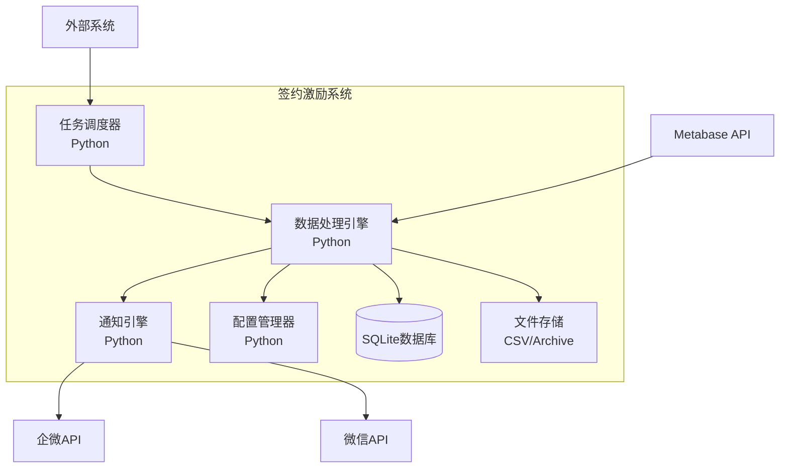

### 3. 组件图（C3 - Component）

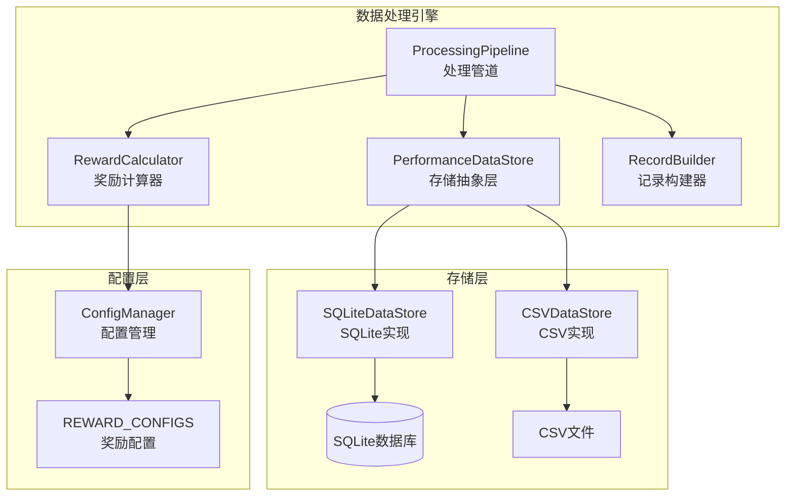

### 4. 核心对象设计（C4 - Code Level）

#### 4.1 领域对象关系图

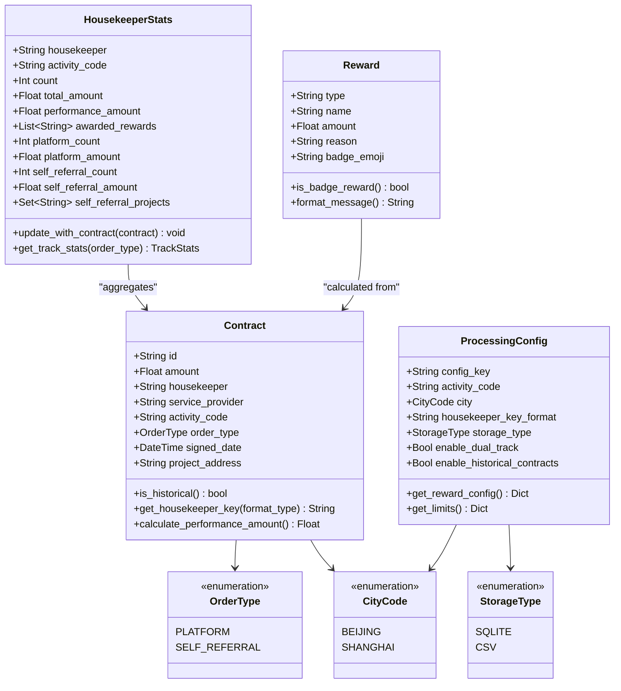

#### 4.2 对象协作图

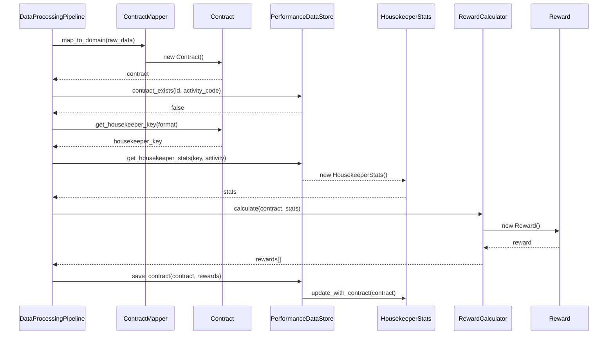

#### 4.3 存储抽象层设计

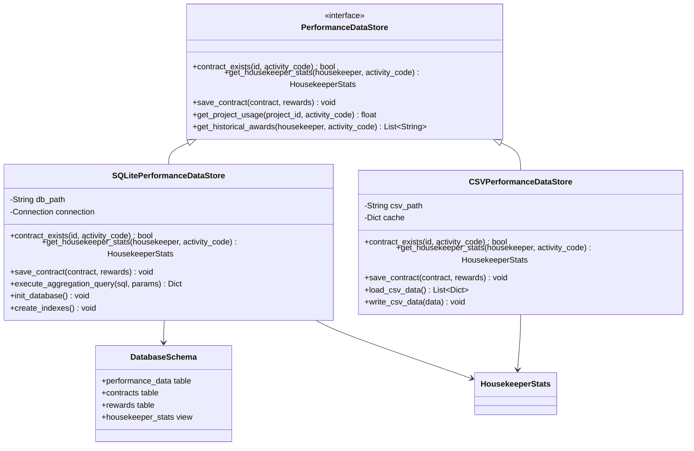

#### 4.4 奖励计算器设计

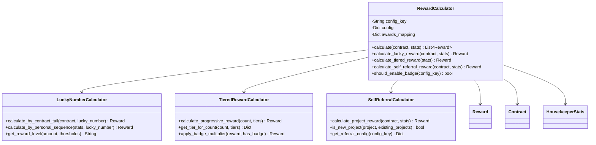

#### 4.5 配置驱动设计

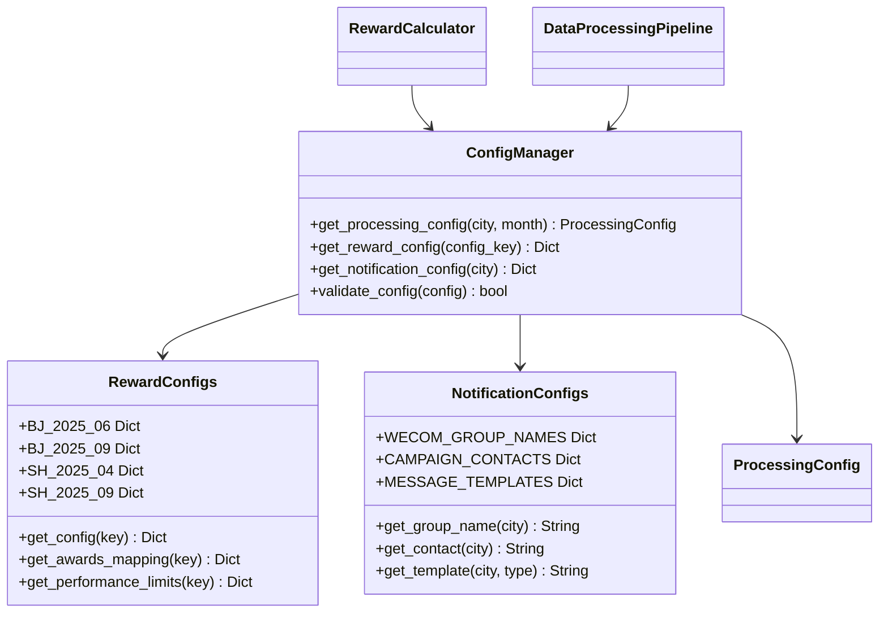

## 解决方案：重建+SQLite

### 核心设计原则
1. **领域驱动设计**: 明确的领域对象和业务概念
2. **存储抽象层**: 支持SQLite和CSV两种实现
3. **数据库驱动**: 用SQL查询替代复杂的内存计算
4. **配置驱动**: 所有差异通过REWARD_CONFIGS控制
5. **管道化**: 标准化的数据处理流程
6. **彻底消除"伪复用"**: 停止通过全局篡改来复用不兼容的函数

## 📈 重构进展状态更新

### ✅ 阶段1：建立新骨架+SQLite - 已完成

**完成状态**: 100%完成，生产就绪
**分支位置**: `refactoring-phase1-core-architecture`
**验证状态**: 全面等价性验证100%通过

#### 已实现的核心组件
- ✅ **统一数据模型** (`modules/core/data_models.py`)
- ✅ **处理管道** (`modules/core/processing_pipeline.py`)
- ✅ **SQLite存储层** (`modules/core/storage.py`)
- ✅ **奖励计算器** (`modules/core/reward_calculator.py`)
- ✅ **配置适配器** (`modules/core/config_adapter.py`)
- ✅ **Job函数重构版** (`modules/core/beijing_jobs.py`, `modules/core/shanghai_jobs.py`)

#### 验证成果
- ✅ **44个测试用例100%通过**
- ✅ **北京6月vs9月差异验证通过**
- ✅ **上海多月份兼容性验证通过**
- ✅ **端到端业务逻辑验证通过**

### 🚀 当前阶段：生产部署和迁移

**目标**: 将已验证的新架构安全部署到生产环境
**策略**: 影子模式 → 渐进式迁移 → 全量切换
**详细计划**: 参见 `docs/phase2_deployment_plan.md`

## 原始设计方案（已实现）

### 阶段1：建立新骨架+SQLite（已完成）

#### 1.1 实现核心领域对象（已完成）
**已实现**: `modules/core/data_models.py`

```python
from dataclasses import dataclass, field
from typing import List, Set, Optional, Dict
from enum import Enum
from datetime import datetime

class CityCode(Enum):
    BEIJING = "BJ"
    SHANGHAI = "SH"

class OrderType(Enum):
    PLATFORM = "platform"
    SELF_REFERRAL = "self_referral"

class StorageType(Enum):
    SQLITE = "sqlite"
    CSV = "csv"

@dataclass
class Contract:
    """合同领域对象 - 统一所有城市的合同表示"""
    id: str
    amount: float
    housekeeper: str
    service_provider: str
    activity_code: str
    order_type: OrderType
    signed_date: datetime
    project_address: str
    pc_contract_num: Optional[str] = None  # 历史合同编号

    def is_historical(self) -> bool:
        """北京9月历史合同判断"""
        return self.pc_contract_num is not None

    def get_housekeeper_key(self, format_type: str) -> str:
        """根据城市生成管家键 - 解决北京/上海差异"""
        if format_type == "housekeeper_provider":
            return f"{self.housekeeper}_{self.service_provider}"
        return self.housekeeper

    def calculate_performance_amount(self, limits: Dict) -> float:
        """计算计入业绩金额 - 应用各种上限规则"""
        performance_amount = self.amount

        # 应用单合同上限
        if limits.get("enable_cap", False):
            cap = limits.get("single_contract_cap", float('inf'))
            performance_amount = min(performance_amount, cap)

        return performance_amount

@dataclass
class HousekeeperStats:
    """管家统计领域对象 - 替代复杂的字典结构"""
    housekeeper: str
    activity_code: str
    count: int = 0
    total_amount: float = 0.0
    performance_amount: float = 0.0
    awarded_rewards: List[str] = field(default_factory=list)

    # 双轨统计扩展（上海9月）
    platform_count: int = 0
    platform_amount: float = 0.0
    self_referral_count: int = 0
    self_referral_amount: float = 0.0
    self_referral_projects: Set[str] = field(default_factory=set)

    def update_with_contract(self, contract: Contract) -> None:
        """用新合同更新统计数据"""
        self.count += 1
        self.total_amount += contract.amount
        self.performance_amount += contract.calculate_performance_amount({})

        # 双轨统计更新
        if contract.order_type == OrderType.PLATFORM:
            self.platform_count += 1
            self.platform_amount += contract.amount
        elif contract.order_type == OrderType.SELF_REFERRAL:
            self.self_referral_count += 1
            self.self_referral_amount += contract.amount
            self.self_referral_projects.add(contract.project_address)

    def get_track_stats(self, order_type: OrderType) -> Dict:
        """获取指定轨道的统计数据"""
        if order_type == OrderType.PLATFORM:
            return {"count": self.platform_count, "amount": self.platform_amount}
        elif order_type == OrderType.SELF_REFERRAL:
            return {"count": self.self_referral_count, "amount": self.self_referral_amount}
        return {"count": self.count, "amount": self.total_amount}

@dataclass
class Reward:
    """奖励领域对象"""
    type: str
    name: str
    amount: float
    reason: str
    badge_emoji: str = ""

    def is_badge_reward(self) -> bool:
        """判断是否为徽章奖励"""
        return "徽章" in self.name or "新星" in self.name

    def format_message(self) -> str:
        """格式化奖励消息"""
        message = f"{self.name}: {self.amount}元"
        if self.badge_emoji:
            message = f"{self.badge_emoji} {message}"
        return message

@dataclass
class ProcessingConfig:
    """处理配置对象 - 替代硬编码的配置"""
    config_key: str
    activity_code: str
    city: CityCode
    housekeeper_key_format: str
    storage_type: StorageType = StorageType.SQLITE
    enable_dual_track: bool = False
    enable_historical_contracts: bool = False

    def get_reward_config(self) -> Dict:
        """获取奖励配置"""
        from modules.config import REWARD_CONFIGS
        return REWARD_CONFIGS.get(self.config_key, {})

    def get_limits(self) -> Dict:
        """获取金额限制配置"""
        return self.get_reward_config().get("performance_limits", {})
```

### 1.2 创建存储抽象层
**新建**: `modules/core/storage.py`

```python
from abc import ABC, abstractmethod
from typing import List, Optional
from .domain_models import Contract, HousekeeperStats

class PerformanceDataStore(ABC):
    """存储抽象层 - 支持多种存储实现"""

    @abstractmethod
    def contract_exists(self, contract_id: str, activity_code: str) -> bool:
        """检查合同是否已存在"""
        pass

    @abstractmethod
    def get_housekeeper_stats(self, housekeeper: str, activity_code: str) -> HousekeeperStats:
        """获取管家累计统计 - 替代复杂的内存计算"""
        pass

    @abstractmethod
    def save_contract(self, contract: Contract, rewards: List[Reward]) -> None:
        """保存合同和奖励信息"""
        pass

class SQLitePerformanceDataStore(PerformanceDataStore):
    """SQLite实现 - 大幅简化累计计算"""

    def contract_exists(self, contract_id: str, activity_code: str) -> bool:
        with sqlite3.connect(self.db_path) as conn:
            cursor = conn.execute(
                "SELECT 1 FROM performance_data WHERE contract_id = ? AND activity_code = ?",
                (contract_id, activity_code)
            )
            return cursor.fetchone() is not None

    def get_housekeeper_stats(self, housekeeper: str, activity_code: str) -> HousekeeperStats:
        """一条SQL替代50+行累计计算代码"""
        with sqlite3.connect(self.db_path) as conn:
            cursor = conn.execute("""
                SELECT
                    COUNT(*) as count,
                    SUM(contract_amount) as total_amount,
                    SUM(performance_amount) as performance_amount,
                    -- 双轨统计
                    SUM(CASE WHEN order_type = 'platform' THEN 1 ELSE 0 END) as platform_count,
                    SUM(CASE WHEN order_type = 'platform' THEN contract_amount ELSE 0 END) as platform_amount,
                    SUM(CASE WHEN order_type = 'self_referral' THEN 1 ELSE 0 END) as self_referral_count,
                    SUM(CASE WHEN order_type = 'self_referral' THEN contract_amount ELSE 0 END) as self_referral_amount
                FROM performance_data
                WHERE housekeeper = ? AND activity_code = ?
            """, (housekeeper, activity_code))

            result = cursor.fetchone()
            return HousekeeperStats(
                housekeeper=housekeeper,
                activity_code=activity_code,
                count=result[0],
                total_amount=result[1],
                performance_amount=result[2],
                platform_count=result[3],
                platform_amount=result[4],
                self_referral_count=result[5],
                self_referral_amount=result[6]
            )
```

### 1.2 设计数据库Schema
**新建**: `modules/core/database_schema.sql`

```sql
CREATE TABLE performance_data (
    id INTEGER PRIMARY KEY AUTOINCREMENT,
    activity_code TEXT NOT NULL,           -- 'BJ-JUN', 'BJ-SEP', 'SH-APR'
    contract_id TEXT NOT NULL,
    housekeeper TEXT NOT NULL,
    service_provider TEXT,
    contract_amount REAL NOT NULL,
    performance_amount REAL NOT NULL,
    order_type TEXT DEFAULT 'platform',    -- 支持双轨统计
    project_id TEXT,                       -- 工单编号
    reward_types TEXT,
    reward_names TEXT,
    created_at TIMESTAMP DEFAULT CURRENT_TIMESTAMP,
    UNIQUE(activity_code, contract_id)
);

-- 索引优化
CREATE INDEX idx_housekeeper_activity ON performance_data(housekeeper, activity_code);
CREATE INDEX idx_contract_lookup ON performance_data(contract_id, activity_code);
```

### 1.4 创建处理管道
**新建**: `modules/core/processing_pipeline.py`

```python
from typing import List
from .domain_models import Contract, ProcessingConfig, HousekeeperStats
from .storage import PerformanceDataStore
from .reward_calculator import RewardCalculator
from .contract_mapper import ContractMapper

class DataProcessingPipeline:
    """统一数据处理管道 - 替代8个重复的Job函数"""

    def __init__(self, config: ProcessingConfig, store: PerformanceDataStore):
        self.config = config
        self.store = store
        self.reward_calculator = RewardCalculator(config.config_key)
        self.contract_mapper = ContractMapper(config.city)

    def process(self, raw_contract_data: List[dict]) -> List[dict]:
        """统一处理流程 - 消除城市间的重复逻辑"""
        processed_records = []

        for raw_contract in raw_contract_data:
            # 1. 原始数据映射为领域对象
            contract = self.contract_mapper.map_to_domain(raw_contract, self.config.activity_code)

            # 2. 数据库去重查询 - 替代CSV文件扫描
            if self.store.contract_exists(contract.id, contract.activity_code):
                continue

            # 3. 数据库聚合查询 - 替代复杂内存计算
            housekeeper_key = contract.get_housekeeper_key(self.config.housekeeper_key_format)
            hk_stats = self.store.get_housekeeper_stats(housekeeper_key, contract.activity_code)

            # 4. 奖励计算 - 配置驱动
            rewards = self.reward_calculator.calculate(contract, hk_stats)

            # 5. 保存到存储层
            self.store.save_contract(contract, rewards)

            # 6. 构建输出记录
            record = self._build_output_record(contract, hk_stats, rewards)
            processed_records.append(record)

        return processed_records

    def _build_output_record(self, contract: Contract, stats: HousekeeperStats, rewards: List[Reward]) -> dict:
        """构建输出记录 - 统一字段格式"""
        base_record = {
            '活动编号': contract.activity_code,
            '合同ID(_id)': contract.id,
            '管家(serviceHousekeeper)': contract.housekeeper,
            '合同金额(adjustRefundMoney)': contract.amount,
            '管家累计单数': stats.count + 1,  # +1 因为包含当前合同
            '管家累计金额': stats.total_amount + contract.amount,
            '奖励类型': ', '.join([r.type for r in rewards]),
            '奖励名称': ', '.join([r.name for r in rewards]),
            '激活奖励状态': 1 if rewards else 0
        }

        # 城市特定字段扩展
        if self.config.enable_dual_track:
            base_record.update({
                '工单类型': '自引单' if contract.order_type == OrderType.SELF_REFERRAL else '平台单',
                '平台单累计数量': stats.platform_count,
                '平台单累计金额': stats.platform_amount,
                '自引单累计数量': stats.self_referral_count,
                '自引单累计金额': stats.self_referral_amount
            })

        return base_record
```

### 1.5 创建奖励计算器
**新建**: `modules/core/reward_calculator.py`

```python
from typing import List
from .domain_models import Contract, HousekeeperStats, Reward
from modules.config import REWARD_CONFIGS

class RewardCalculator:
    """配置驱动的奖励计算器 - 替代硬编码的奖励逻辑"""

    def __init__(self, config_key: str):
        self.config = REWARD_CONFIGS[config_key]
        self.config_key = config_key

    def calculate(self, contract: Contract, hk_stats: HousekeeperStats) -> List[Reward]:
        """计算所有类型的奖励"""
        rewards = []

        # 幸运数字奖励
        lucky_reward = self._calculate_lucky_reward(contract, hk_stats)
        if lucky_reward:
            rewards.append(lucky_reward)

        # 节节高奖励
        tiered_reward = self._calculate_tiered_reward(hk_stats)
        if tiered_reward:
            rewards.append(tiered_reward)

        # 自引单奖励（上海9月）
        if self.config.get("self_referral_rewards", {}).get("enable", False):
            self_referral_reward = self._calculate_self_referral_reward(contract, hk_stats)
            if self_referral_reward:
                rewards.append(self_referral_reward)

        return rewards

    def _calculate_lucky_reward(self, contract: Contract, hk_stats: HousekeeperStats) -> Optional[Reward]:
        """幸运数字奖励计算 - 支持合同尾号和个人顺序两种模式"""
        lucky_config = self.config.get("lucky_rewards", {})
        if not lucky_config:
            return None

        lucky_number = self.config.get("lucky_number", "")
        if not lucky_number:
            return None

        mode = self.config.get("lucky_number_mode", "contract_tail")

        if mode == "personal_sequence":
            # 北京9月：个人签约顺序模式
            personal_sequence = hk_stats.count + 1
            if personal_sequence % int(lucky_number) == 0:
                return Reward(
                    type="幸运数字",
                    name=lucky_config["base"]["name"],
                    amount=float(self.config["awards_mapping"][lucky_config["base"]["name"]]),
                    reason=f"个人第{personal_sequence}个合同"
                )
        else:
            # 传统模式：合同编号尾号
            if contract.id.endswith(lucky_number):
                reward_key = "high" if contract.amount >= lucky_config["high"]["threshold"] else "base"
                reward_name = lucky_config[reward_key]["name"]
                return Reward(
                    type="幸运数字",
                    name=reward_name,
                    amount=float(self.config["awards_mapping"][reward_name]),
                    reason=f"合同编号尾号{lucky_number}"
                )

        return None
```

### 1.6 架构对比：重构前 vs 重构后

#### 重构前的问题架构
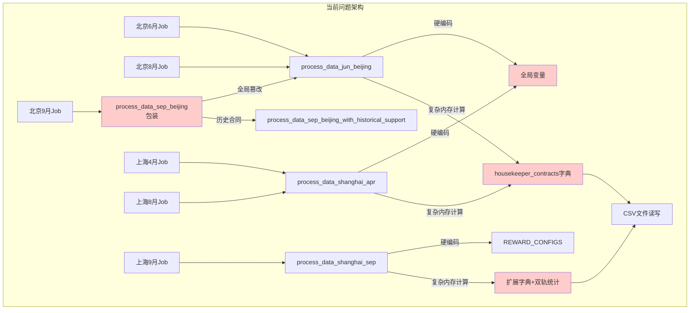

#### 重构后的目标架构
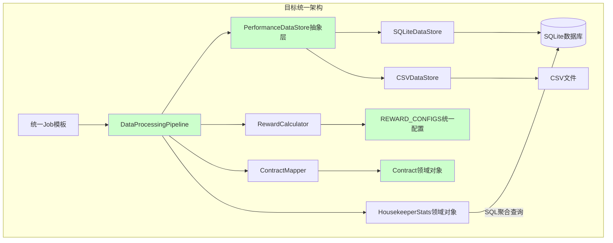

### 1.7 系统对象协作总览

```mermaid
graph TB
    subgraph "领域层 (Domain Layer)"
        Contract[Contract<br/>合同对象]
        Stats[HousekeeperStats<br/>管家统计对象]
        Reward[Reward<br/>奖励对象]
        Config[ProcessingConfig<br/>配置对象]
    end

    subgraph "应用层 (Application Layer)"
        Pipeline[DataProcessingPipeline<br/>处理管道]
        Calculator[RewardCalculator<br/>奖励计算器]
        Mapper[ContractMapper<br/>合同映射器]
        NotificationEngine[NotificationEngine<br/>通知引擎]
    end

    subgraph "基础设施层 (Infrastructure Layer)"
        Store[PerformanceDataStore<br/>存储抽象]
        SQLiteStore[SQLiteDataStore<br/>SQLite实现]
        CSVStore[CSVDataStore<br/>CSV实现]
        Database[(SQLite数据库)]
        Files[CSV文件]
    end

    subgraph "配置层 (Configuration Layer)"
        RewardConfigs[REWARD_CONFIGS<br/>奖励配置]
        NotificationConfigs[通知配置]
    end

    Pipeline --> Contract
    Pipeline --> Stats
    Pipeline --> Calculator
    Pipeline --> Mapper
    Pipeline --> Store

    Calculator --> Reward
    Calculator --> RewardConfigs

    Mapper --> Contract

    Store --> SQLiteStore
    Store --> CSVStore
    SQLiteStore --> Database
    CSVStore --> Files

    Config --> RewardConfigs
    NotificationEngine --> NotificationConfigs

    Contract -.-> Stats : "aggregates to"
    Stats -.-> Reward : "triggers"

    style Contract fill:#e1f5fe
    style Stats fill:#e1f5fe
    style Reward fill:#e1f5fe
    style Config fill:#e1f5fe
    style Pipeline fill:#f3e5f5
    style Calculator fill:#f3e5f5
    style Store fill:#e8f5e8
    style Database fill:#fff3e0
```

### 1.8 对象设计原则验证

#### 单一职责原则 (SRP)
- **Contract**: 只负责合同数据和相关业务逻辑
- **HousekeeperStats**: 只负责管家统计数据的聚合
- **Reward**: 只负责奖励信息的表示和格式化
- **RewardCalculator**: 只负责奖励计算逻辑

#### 开闭原则 (OCP)
- **PerformanceDataStore**: 抽象接口，可扩展新的存储实现
- **RewardCalculator**: 可扩展新的奖励类型而不修改现有代码
- **ProcessingConfig**: 可添加新的配置项而不影响现有功能

#### 依赖倒置原则 (DIP)
- **DataProcessingPipeline**: 依赖抽象的PerformanceDataStore，不依赖具体实现
- **RewardCalculator**: 依赖配置接口，不依赖具体配置实现

#### 接口隔离原则 (ISP)
- **PerformanceDataStore**: 接口方法职责单一，客户端只依赖需要的方法
- **Contract**: 提供特定的业务方法，不强迫客户端依赖不需要的功能

### 验收标准
- [ ] **领域对象模型完成**
  - [ ] Contract、HousekeeperStats、Reward等核心对象
  - [ ] 枚举类型定义（CityCode、OrderType、StorageType）
  - [ ] 对象行为方法实现（业务逻辑封装）
  - [ ] 对象关系图和协作图绘制完成
- [ ] **存储抽象层完成**
  - [ ] PerformanceDataStore抽象接口设计
  - [ ] SQLite和CSV两种具体实现
  - [ ] 配置驱动的存储选择机制
  - [ ] 存储层类图设计完成
- [ ] **处理管道实现**
  - [ ] DataProcessingPipeline统一处理流程
  - [ ] ContractMapper领域对象映射
  - [ ] 配置驱动的差异处理机制
  - [ ] 对象协作序列图验证
- [ ] **架构设计验证**
  - [ ] 组件间依赖关系清晰（依赖图）
  - [ ] SOLID原则遵循验证
  - [ ] 扩展性设计验证（新城市/新功能）
  - [ ] 系统对象协作总览图完成
- [ ] **单元测试覆盖率≥90%**
  - [ ] 每个领域对象的单元测试
  - [ ] 每个应用服务的单元测试
  - [ ] 存储层的集成测试

## 阶段2：北京迁移（2-3天）

### 2.1 北京6月迁移（基准验证）

#### 配置对象化
```python
# 新的配置对象 - 替代硬编码
BJ_JUN_CONFIG = ProcessingConfig(
    config_key="BJ-2025-06",
    activity_code="BJ-JUN",
    city=CityCode.BEIJING,
    housekeeper_key_format="housekeeper",
    storage_type="sqlite",
    enable_dual_track=False,
    enable_historical_contracts=False
)
```

#### 架构迁移对比
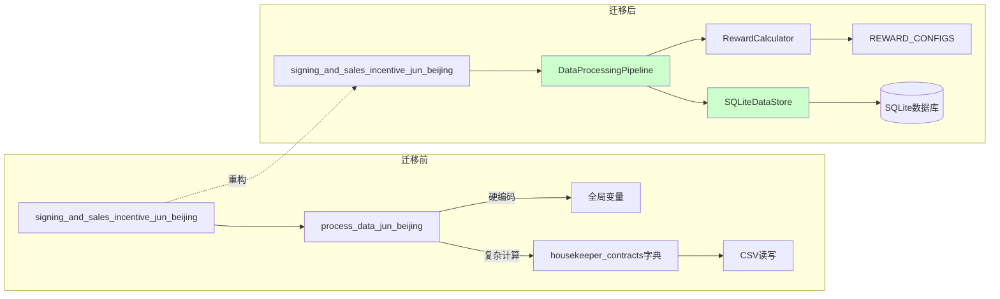

#### 新的Job函数实现
```python
def signing_and_sales_incentive_jun_beijing():
    """重构后的北京6月Job - 使用统一架构"""
    # 1. 配置对象化
    config = BJ_JUN_CONFIG
    store = SQLitePerformanceDataStore("performance.db")

    # 2. 统一处理管道
    pipeline = DataProcessingPipeline(config, store)

    # 3. 获取原始数据
    raw_data = fetch_contract_data_from_metabase(config.api_url)

    # 4. 处理数据 - 消除全局副作用和复杂计算
    processed_data = pipeline.process(raw_data)

    # 5. 通知发送
    notification_engine = NotificationEngine(config)
    notification_engine.send_notifications(processed_data)

    return processed_data
```

### 2.2 北京9月迁移（消除全局副作用）
```python
# 配置
BJ_SEP_CONFIG = ProcessingConfig(
    config_key="BJ-2025-09",  # 直接使用正确配置
    activity_code="BJ-SEP",
    city="BJ",
    housekeeper_key_format="管家",
    enable_historical_contracts=True
)

# 删除问题代码
# 删除 modules/data_processing_module.py:1575-1582 的全局篡改逻辑
# 删除 process_data_sep_beijing 包装函数
```

### 验收标准
- [ ] 消除所有全局副作用
- [ ] 北京测试全部通过
- [ ] 数据输出100%等价
- [ ] 性能不降级

## 阶段3：上海迁移（3-4天）

### 3.1 上海双轨统计简化
```python
# 当前复杂的双轨维护
housekeeper_contracts[hk_key] = {
    'platform_count': 0, 'platform_amount': 0,
    'self_referral_count': 0, 'self_referral_amount': 0,
    'self_referral_projects': set()  # 复杂的去重逻辑
}

# SQLite简化后
SELECT 
    order_type,
    COUNT(*) as count,
    SUM(amount) as amount
FROM performance_data 
WHERE housekeeper = ? AND activity_code = ?
GROUP BY order_type
```

### 3.2 上海配置
```python
SH_SEP_CONFIG = ProcessingConfig(
    config_key="SH-2025-09",
    activity_code="SH-SEP",
    city="SH",
    housekeeper_key_format="管家_服务商",
    enable_dual_track=True  # 启用双轨统计
)
```

### 验收标准
- [ ] 双轨统计逻辑正确
- [ ] 8个扩展字段正确
- [ ] 所有上海测试通过

## 阶段4：清理优化（1-2天）

### 4.1 删除旧代码
- 删除 `process_data_jun_beijing`
- 删除 `process_data_shanghai_apr`
- 删除 `process_data_shanghai_sep`
- 删除所有全局副作用代码

### 4.2 统一Job函数
```python
def execute_monthly_incentive(city: str, month: str):
    """统一的月度激励执行函数"""
    config = get_monthly_config(city, month)
    pipeline = DataProcessingPipeline(config, SQLitePerformanceDataStore())
    return pipeline.process(contract_data)

# 替换所有具体Job函数
signing_and_sales_incentive_jun_beijing = lambda: execute_monthly_incentive("BJ", "jun")
signing_and_sales_incentive_sep_shanghai = lambda: execute_monthly_incentive("SH", "sep")
```

## 预期收益

### 代码简化
- **代码行数减少60%+**: SQL查询替代复杂累计逻辑
- **函数数量减少50%+**: 合并重复函数
- **消除全局副作用**: 提升测试稳定性

### 性能提升
- **去重查询**: O(n)→O(1)，索引查询替代文件扫描
- **累计统计**: 数据库聚合查询替代内存循环
- **内存使用**: 不再加载整个CSV到内存

### 系统稳定性
- **数据一致性**: 事务保证，避免CSV竞争条件
- **并发安全**: 数据库锁机制
- **扩展性**: 便于复杂查询和报表生成

## 风险控制

### 1. 存储抽象层
- 同时支持SQLite和CSV
- 配置驱动选择存储方式
- 测试使用内存SQLite

### 2. 渐进迁移
- 每个阶段独立验证
- 完整的等价性测试
- 快速回滚机制

### 3. 影子模式
- SQLite与CSV并行运行1周
- 验证数据一致性和性能
- 监控系统稳定性

## 功能等价性验证与安全上线保障

### 1. 等价性验证策略

#### 1.1 数据输出等价性验证
**验证目标**: 确保重构后的输出数据与原实现完全一致

**验证方法**:
```python
def verify_data_equivalence(old_csv, new_csv, tolerance=0.01):
    """
    验证两个CSV文件的数据等价性

    Args:
        old_csv: 原实现输出的CSV文件
        new_csv: 重构后输出的CSV文件
        tolerance: 浮点数比较容差

    Returns:
        dict: 验证结果报告
    """
    report = {
        'is_equivalent': True,
        'differences': [],
        'summary': {}
    }

    # 1. 记录数量验证
    old_data = pd.read_csv(old_csv)
    new_data = pd.read_csv(new_csv)

    if len(old_data) != len(new_data):
        report['is_equivalent'] = False
        report['differences'].append(f"记录数量不一致: {len(old_data)} vs {len(new_data)}")

    # 2. 关键字段逐行比较
    key_fields = [
        '合同ID(_id)', '管家(serviceHousekeeper)', '合同金额(adjustRefundMoney)',
        '管家累计单数', '管家累计金额', '计入业绩金额',
        '激活奖励状态', '奖励类型', '奖励名称', '备注'
    ]

    for idx, (old_row, new_row) in enumerate(zip(old_data.iterrows(), new_data.iterrows())):
        for field in key_fields:
            if field in old_row[1] and field in new_row[1]:
                old_val = old_row[1][field]
                new_val = new_row[1][field]

                # 数值字段使用容差比较
                if field in ['管家累计金额', '计入业绩金额', '合同金额(adjustRefundMoney)']:
                    if abs(float(old_val) - float(new_val)) > tolerance:
                        report['is_equivalent'] = False
                        report['differences'].append(
                            f"行{idx+1} {field}: {old_val} vs {new_val}"
                        )
                # 字符串字段精确比较
                else:
                    if str(old_val).strip() != str(new_val).strip():
                        report['is_equivalent'] = False
                        report['differences'].append(
                            f"行{idx+1} {field}: '{old_val}' vs '{new_val}'"
                        )

    return report
```

**验证数据集**:
- **历史真实数据**: 使用最近3个月的生产数据作为验证基准
- **边界用例数据**: 构造包含各种边界情况的测试数据
- **异常数据**: 包含重复合同、异常金额等异常情况的数据

#### 1.2 通知消息等价性验证
**验证目标**: 确保通知消息格式和内容完全一致

**验证方法**:
```python
def verify_notification_equivalence(old_messages, new_messages):
    """验证通知消息等价性"""
    equivalence_report = {
        'group_messages_match': True,
        'personal_messages_match': True,
        'differences': []
    }

    # 1. 群消息验证
    for old_msg, new_msg in zip(old_messages['group'], new_messages['group']):
        if normalize_message(old_msg) != normalize_message(new_msg):
            equivalence_report['group_messages_match'] = False
            equivalence_report['differences'].append({
                'type': 'group_message',
                'old': old_msg,
                'new': new_msg
            })

    # 2. 个人消息验证
    for old_msg, new_msg in zip(old_messages['personal'], new_messages['personal']):
        if normalize_message(old_msg) != normalize_message(new_msg):
            equivalence_report['personal_messages_match'] = False
            equivalence_report['differences'].append({
                'type': 'personal_message',
                'old': old_msg,
                'new': new_msg
            })

    return equivalence_report

def normalize_message(message):
    """标准化消息格式，忽略空格和换行差异"""
    return re.sub(r'\s+', ' ', message.strip())
```

**验证覆盖**:
- 群通知消息格式
- 个人奖励消息格式
- 徽章显示逻辑
- 奖励翻倍计算
- 特殊字符处理

#### 1.3 业务逻辑等价性验证
**验证目标**: 确保核心业务逻辑计算结果一致

**关键验证点**:
- **奖励计算逻辑**: 幸运数字、节节高、自引单奖励
- **累计统计逻辑**: 管家累计单数、累计金额、业绩金额
- **去重逻辑**: 已存在合同ID的处理
- **工单金额上限**: 北京特有的工单金额累计上限逻辑
- **双轨统计**: 上海9月的平台单/自引单分类统计

```python
def verify_business_logic_equivalence(test_cases):
    """验证业务逻辑等价性"""
    results = []

    for test_case in test_cases:
        # 运行原版本
        old_result = run_old_version(test_case['input'])

        # 运行新版本
        new_result = run_new_version(test_case['input'])

        # 比较结果
        is_equivalent = compare_business_results(old_result, new_result)

        results.append({
            'test_case': test_case['name'],
            'equivalent': is_equivalent,
            'old_result': old_result,
            'new_result': new_result
        })

    return results
```

## 实施时间表

- **阶段1**: 3-4天（建立新骨架+SQLite+验证框架）
- **阶段2**: 2-3天（北京迁移+等价性验证）
- **阶段3**: 3-4天（上海迁移+全量验证）
- **阶段4**: 1-2天（清理优化+性能验证）
- **影子模式**: 1周（SQLite与CSV并行，验证等价性和性能）
- **灰度发布**: 1周（部分活动使用SQLite，监控指标）
- **全量上线**: 1周（全部切换到SQLite，持续监控）
- **总计**: 4-5周

### 2. 自动化验证框架

#### 2.1 创建验证测试套件
**新建**: `tests/equivalence/`目录

**测试文件结构**:
```
tests/equivalence/
├── test_data_equivalence.py      # 数据输出等价性测试
├── test_notification_equivalence.py  # 通知消息等价性测试
├── test_business_logic_equivalence.py # 业务逻辑等价性测试
├── fixtures/                     # 测试数据
│   ├── beijing_test_data.csv
│   ├── shanghai_test_data.csv
│   ├── edge_cases_data.csv
│   └── historical_production_data/
├── reports/                      # 验证报告输出目录
└── utils/
    ├── comparison_utils.py       # 比较工具函数
    └── test_data_generator.py    # 测试数据生成器
```

#### 2.2 并行运行验证
**实施策略**: 在重构过程中，新旧版本并行运行

```python
def parallel_verification_test(test_data):
    """并行运行新旧版本，比较输出结果"""

    # 运行原版本
    old_result = run_old_version(test_data)

    # 运行新版本
    new_result = run_new_version(test_data)

    # 比较结果
    equivalence_report = verify_data_equivalence(
        old_result['csv_file'],
        new_result['csv_file']
    )

    # 比较通知消息
    notification_report = verify_notification_equivalence(
        old_result['notifications'],
        new_result['notifications']
    )

    # 生成验证报告
    generate_verification_report(equivalence_report, notification_report)

    return equivalence_report['is_equivalent'] and notification_report['group_messages_match']
```

#### 2.3 持续集成验证
**集成到CI/CD流程**:
```yaml
# .github/workflows/equivalence-verification.yml
name: Equivalence Verification

on:
  pull_request:
    paths:
      - 'modules/core/**'
      - 'modules/processing/**'
      - 'modules/rewards.py'

jobs:
  verify-equivalence:
    runs-on: ubuntu-latest
    steps:
      - name: Run Equivalence Tests
        run: |
          python -m pytest tests/equivalence/ -v --tb=short

      - name: Generate Verification Report
        run: |
          python scripts/generate_equivalence_report.py

      - name: Upload Report
        uses: actions/upload-artifact@v2
        with:
          name: equivalence-report
          path: tests/equivalence/reports/
```

### 3. 安全上线机制

#### 3.1 影子模式部署
**目标**: 新旧系统并行运行，验证一致性

**实施方案**:
```python
class ShadowModeProcessor:
    """影子模式处理器 - 并行运行新旧版本"""

    def __init__(self, enable_shadow=True):
        self.enable_shadow = enable_shadow
        self.old_processor = OldDataProcessor()
        self.new_processor = NewDataProcessor()
        self.comparison_logger = ComparisonLogger()

    def process(self, contract_data):
        """并行处理并比较结果"""
        # 主路径：使用原版本
        primary_result = self.old_processor.process(contract_data)

        if self.enable_shadow:
            try:
                # 影子路径：使用新版本
                shadow_result = self.new_processor.process(contract_data)

                # 比较结果
                comparison = self.compare_results(primary_result, shadow_result)
                self.comparison_logger.log_comparison(comparison)

                # 如果差异过大，发送告警
                if comparison['difference_rate'] > 0.01:  # 1%差异阈值
                    self.send_alert(comparison)

            except Exception as e:
                self.comparison_logger.log_error(f"影子模式执行失败: {e}")

        return primary_result
```

#### 3.2 灰度发布策略
**目标**: 逐步切换到新版本，降低风险

**发布计划**:
```python
class GradualRolloutManager:
    """灰度发布管理器"""

    def __init__(self):
        self.rollout_config = {
            'week1': {'new_version_percentage': 10, 'activities': ['BJ-JUN']},
            'week2': {'new_version_percentage': 30, 'activities': ['BJ-JUN', 'BJ-SEP']},
            'week3': {'new_version_percentage': 60, 'activities': ['BJ-*', 'SH-APR']},
            'week4': {'new_version_percentage': 100, 'activities': ['*']}
        }

    def should_use_new_version(self, activity_code):
        """根据灰度策略决定是否使用新版本"""
        current_week = self.get_current_week()
        config = self.rollout_config.get(current_week, {})

        # 检查活动是否在灰度范围内
        if not self.activity_in_scope(activity_code, config.get('activities', [])):
            return False

        # 根据百分比随机决定
        percentage = config.get('new_version_percentage', 0)
        return random.randint(1, 100) <= percentage
```

#### 3.3 监控和回滚机制
**监控指标**:
- 数据处理成功率
- 通知发送成功率
- 处理时间性能
- 错误率和异常数量
- 数据一致性指标

**自动回滚触发条件**:
```python
class AutoRollbackMonitor:
    """自动回滚监控器"""

    def __init__(self):
        self.thresholds = {
            'error_rate': 0.05,      # 5%错误率
            'performance_degradation': 2.0,  # 性能下降2倍
            'data_inconsistency': 0.01,      # 1%数据不一致
            'notification_failure': 0.02     # 2%通知失败率
        }

    def check_rollback_conditions(self, metrics):
        """检查是否需要自动回滚"""
        rollback_reasons = []

        if metrics['error_rate'] > self.thresholds['error_rate']:
            rollback_reasons.append(f"错误率过高: {metrics['error_rate']:.2%}")

        if metrics['avg_processing_time'] > self.baseline_time * self.thresholds['performance_degradation']:
            rollback_reasons.append(f"性能下降: {metrics['avg_processing_time']:.2f}s")

        if metrics['data_inconsistency_rate'] > self.thresholds['data_inconsistency']:
            rollback_reasons.append(f"数据不一致: {metrics['data_inconsistency_rate']:.2%}")

        if rollback_reasons:
            self.trigger_rollback(rollback_reasons)
            return True

        return False
```

### 4. 验收标准和上线检查清单

#### 4.1 功能等价性验收标准
- [ ] **数据输出100%等价**
  - [ ] 所有关键字段值完全一致
  - [ ] 记录数量完全一致
  - [ ] 字段顺序和格式一致
- [ ] **通知消息100%等价**
  - [ ] 群消息格式和内容一致
  - [ ] 个人消息格式和内容一致
  - [ ] 徽章和特殊标记一致
- [ ] **业务逻辑100%等价**
  - [ ] 奖励计算结果一致
  - [ ] 累计统计逻辑一致
  - [ ] 去重和过滤逻辑一致

#### 4.2 性能验收标准
- [ ] **处理性能不降级**
  - [ ] 单次Job执行时间≤原版本1.2倍
  - [ ] 内存使用≤原版本1.5倍
  - [ ] 数据库查询响应时间≤100ms
- [ ] **并发性能提升**
  - [ ] 支持多Job并发执行
  - [ ] 数据库锁竞争最小化
  - [ ] 文件系统竞争消除

#### 4.3 稳定性验收标准
- [ ] **错误处理完善**
  - [ ] 所有异常场景有适当处理
  - [ ] 错误日志详细且可追踪
  - [ ] 失败时不影响其他Job
- [ ] **数据一致性保证**
  - [ ] 事务完整性保证
  - [ ] 并发访问安全
  - [ ] 数据备份和恢复机制

#### 4.4 安全上线检查清单
- [ ] **影子模式验证通过**
  - [ ] 连续7天无重大差异
  - [ ] 数据一致性>99.9%
  - [ ] 性能指标稳定
- [ ] **灰度发布准备就绪**
  - [ ] 灰度策略配置完成
  - [ ] 监控指标配置完成
  - [ ] 回滚机制测试通过
- [ ] **生产环境准备**
  - [ ] 数据库备份完成
  - [ ] 配置文件更新
  - [ ] 监控告警配置
  - [ ] 应急响应预案准备

## 下一步行动

1. **立即开始阶段1**: 建立存储抽象层和SQLite实现
2. **并行准备**: 设计数据库Schema和处理管道
3. **验证框架搭建**: 创建等价性验证测试套件
4. **监控系统准备**: 配置影子模式和灰度发布监控
5. **团队同步**: 确保团队理解新架构设计和上线流程

---

**文档版本**: v1.0  
**创建日期**: 2025-01-08  
**策略**: 重建+迁移+SQLite集成  
**预期收益**: 代码减少60%+，性能大幅提升，系统稳定性显著改善
