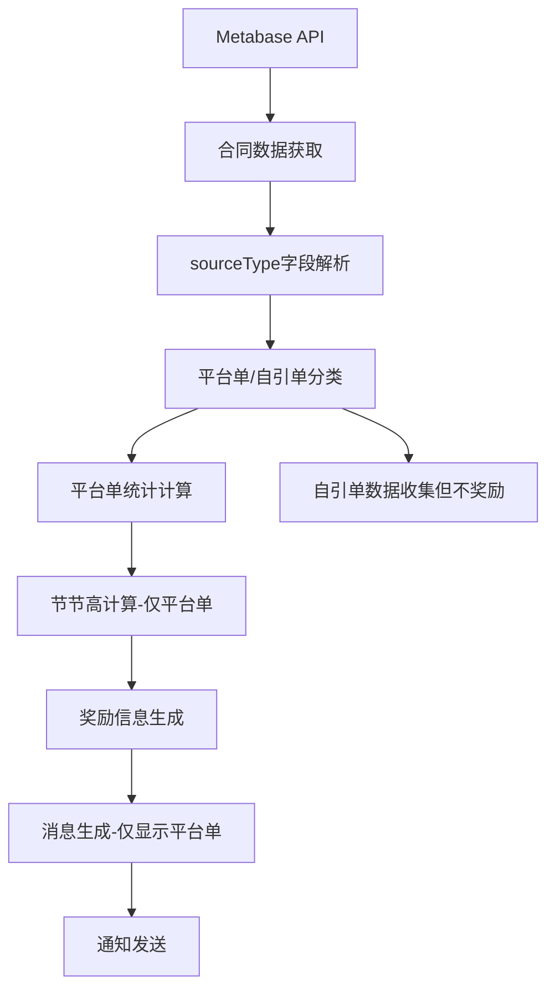

# 上海2025年10月销售激励活动技术设计文档

## 1. 项目概述

### 1.1 活动背景
上海2025年10月销售激励活动是在现有新架构基础上的简化实现，基于上海9月份的成熟逻辑，但**不启用自引单奖励**，专注于平台单的激励机制。

### 1.2 技术目标
- 基于新架构核心模块实现上海10月活动
- 复用上海9月份的成熟配置和逻辑
- 简化自引单处理：不显示自引单奖励，不在消息中显示自引单统计
- 保持与现有系统的完全兼容性

### 1.3 核心特性
- **单轨统计**：仅统计和显示平台单数据
- **节节高奖励**：基于平台单业绩的阶梯奖励
- **简化消息**：消息模板中不显示自引单相关信息
- **配置驱动**：通过SH-2025-10配置实现业务差异化

## 2. 需求分析

### 2.1 业务需求对比

| 需求项目 | 上海9月 | 上海10月 |
|----------|---------|----------|
| **幸运数字** | 无 | 无 |
| **节节高计算** | 仅平台单 | 仅平台单 |
| **合同门槛** | 5个合同 | 5个合同 |
| **自引单奖励** | 启用（红包50元） | **禁用** |
| **消息显示** | 显示平台单+自引单 | **仅显示平台单** |
| **金额上限** | 无上限 | 无上限 |
| **数据源** | Metabase API | Metabase API |

### 2.2 关键业务逻辑

#### 2.2.1 幸运数字逻辑
```
状态：禁用
说明：上海10月不启用幸运数字奖励
```

#### 2.2.2 节节高逻辑
```
门槛：5个平台单合同
计算：基于平台单业绩金额
奖励：基础奖(4万)、达标奖(6万)、优秀奖(8万)、精英奖(12万)、卓越奖(16万)
```

#### 2.2.3 自引单处理
```
数据收集：正常收集自引单数据（用于统计）
奖励计算：不计算自引单奖励
消息显示：不在消息中显示自引单统计信息
```

#### 2.2.4 任务消息格式
```
🧨🧨🧨 签约喜报 🧨🧨🧨

恭喜 [管家] 签约合同（平台单） [合同编号] 并完成线上收款🎉🎉🎉

🌻 本单为本月平台累计签约第 [全局序号] 单，

🌻 个人平台单累计签约第 [个人平台单数] 单。
🌻 个人平台单金额累计签约 [平台单金额] 元

🌻 个人平台单转化率 [转化率]，

👊 [奖励进度信息] 🎉🎉🎉。

注意：不显示自引单相关信息，不显示"累计计入业绩"信息
```

## 3. 技术架构设计

### 3.1 新架构适配方案

#### 3.1.1 核心设计原则
- **配置驱动**：通过 `SH-2025-10` 配置实现业务逻辑
- **模块复用**：复用上海9月的核心逻辑和消息模板
- **最小修改**：仅在消息模板中隐藏自引单显示
- **向后兼容**：不影响现有上海9月和其他活动的功能

#### 3.1.2 架构组件映射

| 新架构组件 | 上海10月适配 | 修改类型 |
|------------|-------------|----------|
| **ProcessingConfig** | 禁用自引单奖励 | 配置修改 |
| **RewardCalculator** | 复用现有逻辑 | 无修改 |
| **NotificationService** | 隐藏自引单显示 | 代码扩展 |
| **DataProcessingPipeline** | 复用现有逻辑 | 无修改 |
| **PerformanceDataStore** | 复用现有逻辑 | 无修改 |

### 3.2 数据流设计



## 4. 详细设计

### 4.1 配置文件设计

#### 4.1.1 SH-2025-10 配置要点
```python
"SH-2025-10": {
    "lucky_number": "",  # 禁用幸运奖
    "lucky_number_sequence_type": "global",
    "performance_limits": {
        "enable_cap": False,  # 上海不启用业绩上限
        "single_contract_cap": 40000
    },
    "tiered_rewards": {
        "min_contracts": 5,  # 平台单需要5个合同
        "tiers": [
            {"name": "基础奖", "threshold": 40000},
            {"name": "达标奖", "threshold": 60000},
            {"name": "优秀奖", "threshold": 80000},
            {"name": "精英奖", "threshold": 120000},
            {"name": "卓越奖", "threshold": 160000}
        ]
    },
    "awards_mapping": {
        "基础奖": "200",
        "达标奖": "300", 
        "优秀奖": "400",
        "精英奖": "800",
        "卓越奖": "1200"
        # 注意：不包含自引单奖励
    },
    "self_referral_rewards": {
        "enable": False,  # 关键：禁用自引单奖励
        "reward_type": "自引单",
        "reward_name": "红包",
        "deduplication_field": "projectAddress"
    },
    "reward_calculation_strategy": {
        "type": "single_track",  # 单轨：仅平台单
        "rules": {
            "platform": {
                "enable_tiered_rewards": True,
                "stats_source": "platform_only"
            }
        }
    }
}
```

### 4.2 代码修改方案

#### 4.2.1 NotificationService扩展
**文件**: `modules/core/notification_service.py`

**修改点**: 添加上海10月专用消息模板，隐藏自引单显示

```python
elif self.config.config_key == "SH-2025-10":
    # 上海10月专用消息模板 - 不显示自引单信息，不显示业绩信息
    order_type = record.get("工单类型", "平台单")
    platform_count = record.get("平台单累计数量", 0)
    platform_amount = self._format_amount(record.get("平台单累计金额", 0))
    conversion_rate = self._format_rate(record.get("转化率(conversion)", ""))

    msg = f'''🧨🧨🧨 签约喜报 🧨🧨🧨

恭喜 {record["管家(serviceHousekeeper)"]} 签约合同（{order_type}） {record.get("合同编号(contractdocNum)", "")} 并完成线上收款🎉🎉🎉

🌻 本单为本月平台累计签约第 {record.get("活动期内第几个合同", 0)} 单，

🌻 个人平台单累计签约第 {platform_count} 单。
🌻 个人平台单金额累计签约 {platform_amount} 元

🌻 个人平台单转化率 {conversion_rate}，

👊 {next_msg} 🎉🎉🎉。
'''
```

#### 4.2.2 Job函数开发
**文件**: `modules/core/shanghai_jobs.py`

**新增函数**: `signing_and_sales_incentive_oct_shanghai_v2`

```python
def signing_and_sales_incentive_oct_shanghai_v2() -> List[PerformanceRecord]:
    """
    上海10月销售激励任务（重构版）
    
    特点：
    - 不启用自引单奖励
    - 消息中不显示自引单信息
    - 复用上海9月的核心逻辑
    """
    logging.info("开始执行上海10月销售激励任务（重构版）")
    
    try:
        # 创建标准处理管道
        pipeline, config, store = create_standard_pipeline(
            config_key="SH-2025-10",
            activity_code="SH-OCT",
            city="SH", 
            housekeeper_key_format="管家_服务商",
            storage_type="sqlite",
            enable_dual_track=False,  # 不启用双轨统计显示
            db_path="performance_data.db"
        )
        
        # 获取合同数据（复用上海9月逻辑）
        contract_data = _get_shanghai_contract_data()
        
        # 处理数据
        records = pipeline.process_contracts(contract_data)
        
        # 发送通知
        _send_notifications(records, config)
        
        return records
        
    except Exception as e:
        logging.error(f"上海10月销售激励任务执行失败: {e}")
        raise
```

## 5. 实施计划

### 5.1 开发任务清单

#### 阶段1：配置验证 ✅
- [x] 确认 `SH-2025-10` 配置正确性
- [x] 验证自引单奖励禁用设置
- [x] 确认奖励阶梯和金额映射

#### 阶段2：代码扩展
- [ ] 扩展 `modules/core/notification_service.py`
  - [ ] 添加上海10月专用消息模板
  - [ ] 隐藏自引单统计信息显示
- [ ] 扩展 `modules/core/shanghai_jobs.py`
  - [ ] 添加 `signing_and_sales_incentive_oct_shanghai_v2` 函数
  - [ ] 复用现有数据获取逻辑

#### 阶段3：测试验证
- [ ] 单元测试：消息模板生成
- [ ] 集成测试：完整数据处理流程
- [ ] 手工测试：真实数据验证

#### 阶段4：部署上线
- [ ] 代码审查和合并
- [ ] 生产环境部署
- [ ] 监控和验证

### 5.2 风险评估

#### 5.2.1 技术风险
- **低风险**：复用成熟的上海9月逻辑
- **配置隔离**：SH-2025-10独立配置，不影响其他活动
- **最小修改**：仅添加消息模板，不修改核心逻辑

#### 5.2.2 业务风险
- **低风险**：业务逻辑简化，减少了复杂性
- **用户体验**：消息更简洁，专注于平台单激励

## 6. 验收标准

### 6.1 功能验收
- [ ] 平台单奖励计算正确
- [ ] 自引单不产生奖励
- [ ] 消息模板不显示自引单信息
- [ ] 数据统计准确

### 6.2 性能验收
- [ ] 处理速度与上海9月相当
- [ ] 内存使用正常
- [ ] 无性能回归

### 6.3 兼容性验收
- [ ] 不影响其他活动功能
- [ ] 配置隔离有效
- [ ] 数据库结构兼容

## 7. 后续维护

### 7.1 监控要点
- 平台单奖励发放准确性
- 自引单数据收集但不奖励
- 消息发送成功率

### 7.2 优化方向
- 根据业务反馈调整消息模板
- 优化数据处理性能
- 完善错误处理机制
